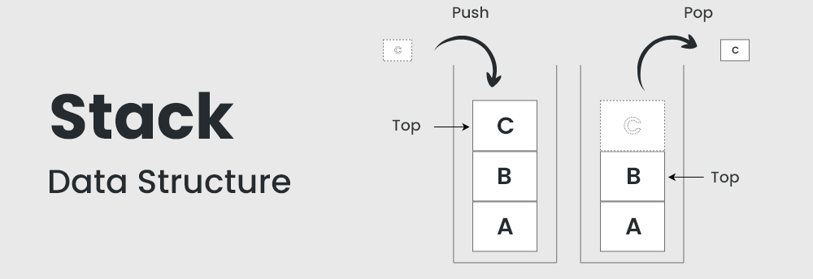
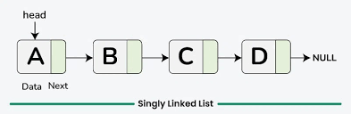

# Data-Structures

## Table of Contents

- [Data-Structures](#data-structures)
  - [Table of Contents](#table-of-contents)
  - [Array](#array)
  - [Stack (LIFO)](#stack-lifo)
  - [Singly Linked List](#singly-linked-list)

## Array

How it Works:

- Contiguous memory allocation
- Fixed or dynamic size
- Supports indexing, slicing, and iteration.

Operations:

- Access: O(1)
- Search: O(n)
- Insert/Delete at end: O(1) (amortized)
- Insert/Delete at start or middle: O(n)

## Stack (LIFO)

How it Works:

- Last-In-First-Out structure
- Can be implemented using an array
- Has a **limit** which determines size of the stack

Operations:

- Push/Pop: O(1)
- Peek: O(1)

Implementation: [Stack](Data-Structures/Stack.py)

## Singly Linked List

How it Works:

- Each link list starts from **head** node
- Each node holds **data** and a reference to the **next** node.
- No direct indexing; traversal required.

Operations:

- Insert/Delete at head: O(1)
- Insert/Delete at tail or by value: O(n)
- Search: O(n)

Implementation: [Singly Linked List](Data-Structures/Singly_Linked_List.py)
