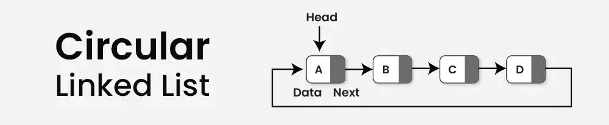

# Data-Structures

## Table of Contents

- [Data-Structures](#data-structures)
  - [Table of Contents](#table-of-contents)
  - [Array (List)](#array-list)
  - [Hash Table (Dictionary)](#hash-table-dictionary)
  - [Stack (LIFO)](#stack-lifo)
  - [Queue (FIFO)](#queue-fifo)
  - [Circular Queue](#circular-queue)
  - [Singly Linked List](#singly-linked-list)
  - [Doubly Linked List](#doubly-linked-list)
  - [Circular Linked List](#circular-linked-list)
  - [Circular Doubly Linked List](#circular-doubly-linked-list)
  - [Tree](#tree)
    - [Binary Tree](#binary-tree)
      - [Full Binary Tree Formulas](#full-binary-tree-formulas)
      - [Binary Tree Traversal Methods](#binary-tree-traversal-methods)
    - [Binary Search Tree](#binary-search-tree)
    - [Heap (Priority Queue)](#heap-priority-queue)

## Array (List)

Key Features:

- Contiguous memory allocation
- Fixed or dynamic size
- Supports indexing, slicing, and iteration.

Operations:

- Access: O(1)
- Search: O(n)
- Insert/Delete at end: O(1) (amortized)
- Insert/Delete at start or middle: O(n)

## Hash Table (Dictionary)

Key Features:

- Uses hashing to store key-value pairs
- Handles collisions via chaining or open addressing

Operations:

- Insert/Search/Delete: O(1) average

## Stack (LIFO)

Key Features:

- Last-In-First-Out structure
- Can be implemented using an array
- Has a `limit` which determines size of the stack

Operations:

- Push/Pop: O(1)
- Peek: O(1)

**Implementation**: [Stack](Data-Structures/stack.py)

## Queue (FIFO)

Key Features:

- First-In-First-Out structure
- `front` points to the first member of queue
- `rear` points to the last member of queue
- Has a `limit` which determines size of the queue

Operations:

- Enqueue/Dequeue: O(1)

**Implementation**: [Queue](Data-Structures/queue.py)

## Circular Queue

Key Features:

- Efficient use of space.
- Front and rear move in a circular manner using modulo operator
- In (simple) queue if the queue is full and you perform a dequeue, there is no way to enqueue another element until the queue gets fully empty; by using a circular queue this issue is solved.

Operations:

- Enqueue/Dequeue: O(1)

**Implementation**: [Circular Queue](Data-Structures/circular_queue.py)

## Singly Linked List

Key Features:

- Each link list starts from `head` node
- Each node holds `data` and a reference to the `next` node.
- No direct indexing; traversal required.

Operations:

- Insert/Delete at head: O(1)
- Insert/Delete at tail or by value: O(n)
- Search: O(n)

**Implementation**: [Singly Linked List](Data-Structures/singly_linked_list.py)

## Doubly Linked List

Key Features:

- Forward and backward traversal.
- Each node holds **prev** as a reference to the pervious node.

Operations:

- Insert/Delete at head: O(1)
- Insert/Delete at tail or by value: O(n)
- Search: O(n)

**Implementation**: [Doubly Linked List](Data-Structures/doubly_linked_list.py)

## Circular Linked List

Key Features:

- No `None` at the end, tail (end node) points to the `head`.
- Can traverse infinitely if not careful.

Operations:

- Insert/Delete at head: O(1)
- Insert/Delete at tail or by value: O(n)
- Search: O(n)

**Implementation**: [Circular Linked List](Data-Structures/circular_linked_list.py)

## Circular Doubly Linked List

Key Features:

- Bi-directional circular structure
- `Tail` node connects to `head` and vice versa

Operations:

- Insert/Delete at head/tail: O(1)
- Insert/Delete by value: O(n)
- Search: O(n)

_Not implemented since its very similar to the circular linked list_.
**Refer to**: [Circular Linked List](Data-Structures/circular_linked_list.py)

## Tree

Key Features:

- `Root`: The topmost node in a tree (**only one root**, **level = 0**).
- `data`: Value stored in the node.
- `Left`: A pointer to the current node's left child.
- `right`: A pointer to the current node's right child.

---

- `Parent`: A node that has child nodes.
- `Child`: A node that descends from another node.
- `Leaf` (External Node): A node with no children (**degree = 0**, **height = 0**).
- `Subtree`: Any node along with its descendants forms a subtree.
- `Edge`: Connection between two nodes.
- `Degree`
  - The **degree of a node** is the **number of children** it has.
  - The **degree of a tree** is the _maximum degree_ among all its nodes.
- `Level (depth)`
  - The level of a node is the **number of edges from the root to the node**.
  - Root is always at level 0 (sometimes level 1, depending on convention).
- `Height`
  - The height of a node is the number of edges on **the longest path from that node to a leaf**.
  - The height of the tree is the height of the root node.
  - A leaf node has height 0.

### Binary Tree

Key Features:

- `Binary Tree`: each node has ≤ 2 children (**Max Degree ≤ 2**)
- `Full Binary Tree`: a tree where every node has either **0 or 2 children** — never just one.
- `Non-Full Binary Tree`: a tree that has **a node with exactly one child**.
- `Balanced Binary Tree`: a tree where **the left and right subtrees of every node differ in height by at most 1**.
- `Unbalanced Binary Tree`: a tree where **the height difference between the left and right subtrees of any node is more than 1**.

Operations:

- Search/Insert/Delete: O(log n) average, O(n) worst (unbalanced)

**Implementation**: [Binary Tree](Data-Structures/binary_tree.py)

#### Full Binary Tree Formulas

- `h` = height of the tree (root at height 0)
- `n` = number of nodes
- `L` = level number (starting from 0)

- `MaxNodes(h) = 2^(h + 1) - 1`
- `MinNodes(h) = 2 * h + 1`
- `MaxHeight(n) = (n - 1) / 2`
- `NodesAtLevel(L) = 2^L`
- `Height(n) = ⌊log₂(n + 1)⌋ - 1`

#### Binary Tree Traversal Methods

- traversing means visiting each node exactly once!

1. **Depth-First Traversal (DFS)**

   - _In-order_ (Left → Root → Right )
   - _Pre-order_ (Root → Left → Right)
   - _Post-order_ (Left → Right → Root)

- If you have two out of the DFS traverses and one of them is _in-order_, you can draw the whole tree!

2. **Breadth-First Traversal (BFS)**
   - Visits nodes level by level from left to right.

| Traversal   | Order                     | Use Case                 |
| ----------- | ------------------------- | ------------------------ |
| In-order    | Left → Root → Right       | Sort nodes (in BST)      |
| Pre-order   | Root → Left → Right       | Tree copy, serialization |
| Post-order  | Left → Right → Root       | Deletion, freeing memory |
| Level-order | Top → Bottom (Left→Right) | Shortest path, BFS       |

### Binary Search Tree

Key Features:

- `left` < `root` < `right` on every sub-tree and node.
- **In-order** traversing of the BST will returns an **ordered list** of its nodes!

Operations:

- Search/Insert/Delete: O(log n)

**Implementation**: [Binary Search Tree](Data-Structures/binary_search_tree.py)

### Heap (Priority Queue)

- A Heap is a specialized **complete binary tree** where each node satisfies the heap property:
  - Complete binary tree means all levels are completely filled except possibly the last, which is filled from left to right.
  - Usually implemented using `arrays`, not linked nodes.
  - **`heapify`**: is converting an unsorted array into a **heap**.
- **Max Heap**: Each parent’s value is greater than or equal to its children.
- **Min Heap**: Each parent’s value is less than or equal to its children.
- Not suitable for fast searching of arbitrary elements (only efficient for `root` access).
- Efficient for **priority-based processing** (e.g., task scheduling, Dijkstra’s algorithm).

Operations:

- peek(min/max) : O(1)
- insertion/extract(min/max): O(log n)
- Search/heapify: O(n)
- sorting: O(n log n)

**Implementation**: [Heap](Data-Structures/heap.py)

<!-- TODO: add graph data-structure -->
