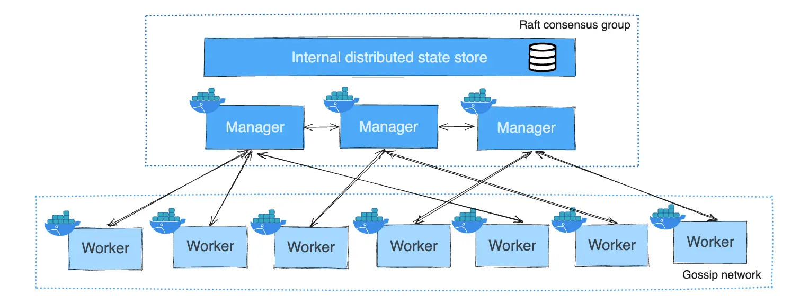

# Docker

## Table of Contents

- [Docker](#docker)
  - [Table of Contents](#table-of-contents)
  - [Introduction](#introduction)
    - [Container](#container)
      - [Image](#image)
      - [Engine](#engine)
      - [Runtime](#runtime)
    - [OCI - Open Container Initiative](#oci---open-container-initiative)
    - [CRI - Container Runtime Interface](#cri---container-runtime-interface)
  - [Installation](#installation)
  - [Introduction](#introduction-1)
  - [Network](#network)
  - [Volume-Mount \& Bind-Mount](#volume-mount--bind-mount)
  - [DockerFile](#dockerfile)
  - [Images](#images)
  - [Containers](#containers)
  - [Inspecting \& Logs](#inspecting--logs)
  - [Examples](#examples)
  - [Docker Compose](#docker-compose)
  - [Docker Swarm](#docker-swarm)
    - [Nodes (servers)](#nodes-servers)
      - [Manager Nodes (Master)](#manager-nodes-master)
      - [Worker Nodes (Slave)](#worker-nodes-slave)
    - [Setup Docker Swarm](#setup-docker-swarm)
      - [Swarm Cluster Network Configuration](#swarm-cluster-network-configuration)
      - [Routing Mesh](#routing-mesh)
    - [Commands](#commands)
      - [Nodes](#nodes)
      - [Services](#services)
    - [Rolling Update](#rolling-update)
      - [Configuration \& Commands](#configuration--commands)
    - [Stack Deploy](#stack-deploy)
    - [Docker Secrets](#docker-secrets)
    - [Docker Local Registry](#docker-local-registry)

## Introduction


| Feature         | Virtualization                | Containerization                         |
| --------------- | ----------------------------- | ---------------------------------------- |
| OS per workload | Yes (Guest OS)                | No (shared Host OS)                      |
| Isolation level | Strong (hardware-level)       | Process-level (kernel shared)            |
| Startup time    | Minutes                       | Seconds or less                          |
| Resource usage  | Heavy                         | Light                                    |
| Portability     | OS-agnostic                   | Kernel-dependent                         |
| Use cases       | Multi-OS apps, legacy systems | Microservices, DevOps, cloud-native apps |

### Container

#### Image

A _read-only (immutable)_ package containing everything an app needs to run:

- App code
- Dependencies
- System libraries
- Environment configuration

#### Engine

The high-level tool you use to build, pull, and run containers.

- Examples: `Docker Engine`, `Podman`, `CRI-O`.
- Takes your container image and turns it into a running container.
- Talks to the container runtime under the hood.
- Handles networking, volumes, and other orchestration tasks.

#### Runtime

The low-level component that actually executes containers and provides isolation.

- Examples:
  - Low-level runtimes: `runc`, `crun`
  - High-level runtimes: `containerd`, `CRI-O`
- Talks directly to the OS kernel (using Linux namespaces, cgroups).
- Creates the container process from the image’s filesystem and metadata.
- Interactions with runtimes usually are _not direct_ and happens through container _engines_.

### OCI - Open Container Initiative

- An open standard for container images and runtimes.
- Before OCI, different tools (Docker, CoreOS rkt, etc.) used their own formats, which hurt portability. OCI made a universal standard so containers could run anywhere.
- Main Specs:

  - **OCI Image Spec** – How container images are structured (layers, config JSON, manifests).
  - **OCI Runtime Spec** – How to run a container from an unpacked image (filesystem layout, process config).
  - **OCI Distribution Spec** – How images are pushed/pulled over registries.

- Example:
  - `runc` is an OCI-compliant runtime, meaning it can run any OCI-compliant container image.

### CRI - Container Runtime Interface

- A **gRPC API standard** that lets Kubernetes talk to container runtimes.
- Kubernetes used to depend heavily on Docker’s engine API. That was limiting, so CRI was created to make Kubernetes runtime-agnostic.

- How it works:

  - Kubernetes’ **kubelet** calls the CRI API.
  - Any runtime implementing CRI (via CRI-O, containerd, etc.) can respond.
  - This allows Kubernetes to switch runtimes without changing kubelet code.

**Stack View**

```scss
Kubernetes (kubelet)
      ↓  CRI API
High-level Runtime (containerd, CRI-O)
      ↓  OCI Runtime Spec
Low-level Runtime (runc, crun)
      ↓  OCI Image Spec
Container Image
```

## Installation

Official docker installation process: [docker-installation](https://docs.docker.com/engine/install/)

In order to manage docker as a non-root user; follow the post installation process: [docker-post-installation](https://docs.docker.com/engine/install/linux-postinstall/)

```sh
# check docker status
systemctl status docker

# start docker
systemctl start docker

# keep docker active after reboot
systemctl enable docker

# docker client & server version
docker version
# It's recommended to have same version for both client & server!

# Detailed docker service information
docker info

# docker commands help
docker --help

# simple hello-word app for checking docker installation and health
docker container run hello-world

# login to docker-hub
docker login

# logout from docker-hub
docker logout
```

## Introduction

.jpg>)

.webp>)

- **Entrypoint**: all containers have an entrypoint which run every time a container is started and applies the work-load (Default: `/bin/sh -c <CMD>`). you can inspect container's entrypoint from the provided path by `.Config.Entrypoint`.

for handling containers, both their **name** and **ID** can be used!

## Network

**Default Networks and drivers**

| Network Name | Driver   | Description                                                                                                                                   |
| ------------ | -------- | --------------------------------------------------------------------------------------------------------------------------------------------- |
| `bridge`     | `bridge` | The default network for containers on a single host if none is specified. Suitable for container-to-container communication on the same host. |
| `host`       | `host`   | Shares the host’s network stack directly. Container uses the host’s IP address and ports. Only available on Linux.                            |
| `none`       | `null`   | Disables networking entirely. The container has no network access. Useful for security or testing.                                            |

- Networks are isolated in docker.
- Container's IP address is not static, so it's better to use it's name or define an alias for it, when you need communication in the same network.


```sh
# list networks
docker network ls

# remove unused networks
docker network prune

# create a new network
docker network create --subnet=192.168.1.0/24 --gateway=192.168.1.1 <name>
# `--driver <network-driver>`: creating a network with the specified driver
# `subnet`: customizing network IP range
# `gateway`: specifying network gateway

# add container to network
docker network connect --alias <alias-name> <network> <container>
# Use 'alias' for connecting containers, since their IP can change for any reason and interrupting network communications!
# aliases help your system to operate.

# remove container from network
docker network disconnect <network> <container>
```

**`macvlan` Network Driver**

- The `macvlan` network driver in Docker is a special type of network that allows a container to appear as if it’s a **physical device** directly connected to your network — with its own **MAC address** and **IP address** on the local LAN, instead of sharing the host’s network interface like with `bridge` or `host`.
- **Native LAN access**: Containers can talk directly to the local network without NAT.
- Useful for:
  - Running legacy apps expecting to be on the LAN.
  - Giving containers dedicated IP addresses for external services.
  - Avoiding NAT overhead.

```sh
# creating a network with macvlan driver
docker network create --driver macvlan --subnet=192.168.1.0/24 --gateway=192.168.1.1 -o parent=ens33 <name>
# `-o parent=<NIC>` attaches macvlan network to the specified physical network interface on the host
```

## Volume-Mount & Bind-Mount

| Volume                           | Bind-Mount                          |
| -------------------------------- | ----------------------------------- |
| Managed by Docker daemon         | Managed by non-Docker processes     |
| Path: `/var/lib/docker/volumes/` | Path: Any where on the host system  |
| Can be used in `Dockerfile`      | Can **not** be used in `Dockerfile` |

**Data Propagation**

| Host  | Container | Mount                                                   |
| ----- | --------- | ------------------------------------------------------- |
| Empty | Data      | data is copied from **container to host**               |
| Data  | Empty     | data is copied from **host to container**               |
| Empty | Empty     | host and container are **synced**                       |
| Data  | Data      | host data _over-rides_ container data (**over-shadow**) |

```sh
# list volumes
docker volume ls
# 'anonymous volume': are volumes without names (some of them are created during build processes and used as cache for building layers)
# to prevent filling storage, remove anonymous volumes once in a while

# remove unused volumes
docker volume prune

# remove volume(s)
docker volume rm <volume(s)>

# remove all volumes
docker volume rm $(docker volumes ls -q)

# volume mount
docker run -v <volume>:<app-data-path> <image>
docker run --mount type=volume,source=<volume>,target=<app-data-path> <image>
# volume gets created if it doesn't exist!

# bind mount
docker run -v <host-path>:<app-data-path> <image>
docker run --mount type=bind,source=<host-path>,target=<app-data-path> <image>
# use absolute paths!
# by adding `readonly` after defining source and target, source becomes readonly and container can not change it!

# temporary mount
docker run --mount type=tmpfs,destination=<data-path> <image>
# dedicates temporary memory space as source for destination, when container gets removed, its data is also removed!
# useful to prevent writing sensitive data on disk
```

## DockerFile

- `FROM`: **Sets the base image (scratch)** for subsequent instructions

- `LABEL`: Adds **metadata** to the image as key-value pairs (e.g. maintainer, version, etc.).
- `ENV`: Sets **environment variables**. These persist in subsequent layers and inside the running container.
- `ARG`: Defines a **build-time variable**. These are not available at runtime (use `ENV` for that).

---

- `WORKDIR`: Sets the **working directory** for the container (for RUN, CMD, ENTRYPOINT, etc.). Like `cd` in bash.
- `ADD`: Copies files/directories from source to the container. Supports **remote URLs and auto-extracting tar files**.
- `COPY`: Copies files/directories from the build context into the container. Like `ADD`, but simpler and more predictable.
- `RUN`: **Executes a command** in a new layer on top of the current image and commits the result. Used to install packages, etc.
- `EXPOSE`: **Documents the port(s)** the container will listen on at runtime. It does not actually publish them.
- `USER`: Specifies the **user** (UID/GID) to use when running the image.
- `CMD`: **Provides default arguments** for the container (overridden by `docker run` arguments). Only one CMD allowed (use shell or exec form).
- `ENTRYPOINT`: Configures a **container to run as an executable**. Can be used with `CMD` to pass default arguments.

---

- `VOLUME`: Creates a mount point and marks it as a **volume** to persist data or share between containers.
- `ONBUILD`: Adds a trigger instruction that is **executed when the image is used as a base** for another image.
- `STOPSIGNAL`: Sets the system call signal sent to the container to **gracefully stop** it (e.g., `SIGTERM`).
- `HEALTHCHECK`: a **command to check container health**. Docker uses it to determine if the container is healthy.
- `SHELL`: Allows changing the default shell used for `RUN` commands (default is `["/bin/sh", "-c"]` on Linux).

**Best Practices**:

- Use official images or minimal base images (Prefer _language-specific_ base images)
- Use multi-stage builds (reduce image size by separating build and runtime environments)
- Document exposed ports and metadata (e.g. maintainer, version, etc.)
- Use Environment Variables (`ENV`) instead of hardcoding paths or other variables.
- Set WORKDIR instead of cd (use WORKDIR to define working directory; it’s clearer and Docker-layer aware)
- Install only what's necessary and combine RUN commands to reduce layers
- Clean up temporary files (remove caches and temp files after installing packages)
- Use non-root user (improves security by preventing privilege escalation in case of a container exploit)
- Minimize COPY scope using docker ignore (only copy what’s needed, use `.dockerignore` to skip unnecessary files e.g. node_modules, .git, etc.)
- Use ENTRYPOINT + CMD properly (ENTRYPOINT defines the fixed command; CMD defines default args -can be overridden-)
- Use specific tag for each image which shows file-version (e.g. _jenkins:2.1.4_)
- Use Linters for assessing Dockerfiles ([`hadolint`](https://github.com/hadolint/hadolint))
- Add HEALTHCHECK (helps detect if the app inside the container is working correctly)
- Limit containers processes during creation (use constraints like _CPU_ and _memory_ limits and _control group (cgroup)_ configurations)
- Analyze docker image layers ([`dive`](https://github.com/wagoodman/dive))

## Images

```sh
# list images
docker image ls

# remove unused images
docker image prune

# download an image from registry
docker pull <image>:<version>
# if version tag is not mentioned 'latest' will be considered!

# tag an image which refers to the source image
docker tag <source-image>:<version> [registry]/<new-name>:<new-version>
# you can mention your docker-hub's account as registry if you want to push images there!

# upload an image to a registry
docker push [registry]/<image>:<version>

# list image history for its layers
docker history <image>

# removing image(s)
docker rmi <image(s)>
docker image rm <image(s)>

# save image to a tar archive (streamed to STDOUT by default)
docker save -o <file> <image>
# `-o`: output
# then you can use FTP to more your file $ ftp <file> ...

# Load an image from a tar archive or STDIN
docker load -i <file>

# creating an image from container
docker commit <container>

# For moving images use 'save/load' commands!
# For moving containers file-system use 'export/import' commands!

# building a custom image from DockerFile
docker build -t <image-name>:<version> -f <DockerFile>
# only use small-letters for image name
# by default docker looks for 'DockerFile' if file is not mentioned (pass . to specify current directory)

# search docker-hub and return matched images
docker search <image>
```

## Containers

```sh
# create container
docker run --name <container-name> -p <system-port>:<container-port> -v <volume>:<data-path> <image>:<image-version>
# General configuration
# `--name`: dedicate a name to container (when not provided a random name will be dedicated to container)
# `-e`: set environment variables for running container

# Life-cycle configuration
# `-d` `--detach`: run container in background (print container ID as response)
# `--rm`: remove container after exiting
# `--restart=<condition>:<max-retry>`: restart container on the mentioned 'condition' and retry for 'max-retry' times

# Network configuration
# `-p` `--publish`: publish container's port(s) to the host
# `--network <network>`: add container to the desired network (if network doesn't exist, it will be created!)

# Persisting data configuration
# `-v <volume>:<data-path>`: volume mount (volume gets created if it doesn't exist)
# `-v <host-path>:<data-path>`: bind-mount (no volume gets created)
# `--mount type=volume,source=<volume>,target=<data-path>`: volume mount (volume gets created if it doesn't exist)
# `--mount type=bind,source=<host-path>,target=<data-path>`: bind mount (no volume gets created)


# list Up containers
docker ps
# `-l`: show latest created container with up status
# `-a`: show all container including both up and down (exited) containers
# `-q`: only returning containers' ID

# starting an interactive bash shell inside running container
docker exec -it <container> bash
# `-i` (interactive): Keeps STDIN open, so you can type input
# `-t` (TTY): Allocates a pseudo-terminal, so the output looks like a normal terminal session

# start container(s)
docker start <container(s)>

# stop container(s)
docker stop <container(s)>

# restart container(s)
docker restart <container(s)>

# rename container
docker rename <container> <new-name>

# remove container(s)
docker rm <container(s)>
# `-f` or `--force`: force the removal of a running container (uses SIGKILL)

# kill container(s) forcefully
kill -9 <container-PIDs>
# failure exit code will be shown in container's exit status

# kill container(s)
docker kill <container(s)>
# If used, docker believes you know what you are doing and failure exit code (137) is not mentioned in container's exit status (0 is shown)

# remove stopped containers
docker container prune

# copy files/folders between a container and the local filesystem
docker cp <source-path> <container>:<container-path> # copy from local to container
docker cp <container>:<container-path> <source-path> # copy from container to local
```

## Inspecting & Logs

- `var/lib/docker` -> Docker log-driver default path
- Docker logs path can be passed to `ELK` stack for managing and monitoring container logs!
- You can also use `gelf` log-driver to manage logs directly with _logstash_; but use `local` log-driver instead to prevent losing logs when logstash connection fails!
- `JSON` -> default log-driver format (change the format to _filesystem_ or any other format (e.g. `local`) for production)
- `etc/docker/daemon.json` -> create/edit this file for logging configuration - [Docker Logging Configuration](https://docs.docker.com/engine/logging/configure/)
- after configuration of logging, restart docker service (`systemctl restart docker.service`)

```sh
# fetch logs of a container
docker logs <container>
# `-f`: follow log output
# `-n <n>` `--tail <n>`: number of logs to show from the end of logs (default: all)

# attaching to a container and following logs
docker attach <container>
# use <C-p><C-q> escape sequence for detaching from container without stopping it!

# display a live stream of container(s) resource usage statistics
docker stats <container>
# `--no-stream`: display a snapshot of resource usage instead of live stream

# list port mappings or a specific mapping for the container
docker port <container>

# Display container's running processes
docker top <container>

# Return low-level information on Docker objects
docker inspect <container/image/volume/network>
```

## Examples

```sh
# inspecting containers config related details
docker inspect -f '{{.Config}}' <container>
# using format string (-f --format) instead of grep since it works better on JSON objects!
# {{.Mounts}} -> Data Mounting configuration
# {{.Config.Env}} -> environment variables
# {{.Config.ExposedPorts}} -> exposed ports
# {{.NetworkSettings.Networks.bridge.IPAddress}} -> Running container's IP address

# inspecting all the containers' names and IP addresses
docker inspect -f '{{.Name}} ---> {{.NetworkSettings.Networks.bridge.IPAddress}}' $(docker container ls -aq)

# creating an ubuntu container which gets removed after exiting
docker run -exec -it --rm ubuntu /bin/bash
# if /bin/bash is not executed, ubuntu exits immediately after running since it doesn't have an entrypoint

# ping another container in the same network
docker exec -it <container> ping <target-container>
# if you saw 'executable file not found in $PATH', it means 'ping' command is not available; you can install it by following below process.

# installing ping command on a container
docker exec -if <container> /bin/bash
apt-get update
apt-get install iputils-ping

# running a MySQL database
docker run --name mysql-db -e MYSQL_ROOT_PASSWORD=my-secret-pw -d mysql:8.0.21
# By using 'MYSQL_RANDOM_ROOT_PASSWORD' as environment variable, a random password is generated for root user;
# which can be found in the container logs (look for GENERATED ROOT PASSWORD)
```

## Docker Compose

Best option for managing multiple dependent services with just one file, and creating dependency for order of running containers, also you can specify condition checks for your dependencies.

By default Docker Compose will look for `docker-compose.yaml` file, in order to use different files, you must use `-f` flag for passing your file

```sh
# Parse, resolve and render compose file in canonical format
docker compose -f <docker-compose-file> config

# download service image(s)
docker compose -f <docker-compose-file> pull

# build/rebuild service image(s)
docker compose -f <docker-compose-file> build
# `--no-cache`: Do not use cache when building the image

# create and run service containers
docker compose -f <docker-compose-file> up
# `--build`: build images before starting containers
# `-d`: run containers in detached mode

# stop and remove service containers, networks (keeps volumes)
docker compose -f <docker-compose-file> down
# `-v`: removing volumes as well!

# stop service containers (doesn't remove them)
docker compose -f <docker-compose-file> stop

# start service containers
docker compose -f <docker-compose-file> start

# snapshot of service containers logs
docker compose -f <docker-compose-file> logs
# `-f`: follow logs
# `-t`: add timestamp to logs

# running an interactive bash shell on desired service
docker compose -f <docker-compose-file> exec -it <service> /bin/bash

# running a command inside your container's shell
docker compose -f <docker-compose-file> exec <service> sh -c "<command>"

# list service containers status
docker compose -f <docker-compose-file> ps

# list service containers images
docker compose -f <docker-compose-file> images

# list service containers processes
docker compose -f <docker-compose-file> top

# scaling docker compose services
docker compose -f <docker-compose-file> scale <service-1>=<n> <service2>=<m> ...
```

- you can also run docker compose commands explicitly on your desired services if you provide the **service's name** after you command!
- **SELinux context modifier**: managing volumes in docker compose (read-write access)
  - `z`: private content - container specific
  - `Z`: shared content across containers

## Docker Swarm

**Docker Swarm Vs. Kubernetes**

| Aspect                          | **Docker Swarm**                                         | **Kubernetes**                                               |
| ------------------------------- | -------------------------------------------------------- | ------------------------------------------------------------ |
| **Origin**                      | Developed by Docker, Inc.                                | Open-source by Google, now CNCF project                      |
| **Ease of Setup**               | ⭐⭐⭐⭐⭐ (Very Simple, `docker swarm init`)            | ⭐⭐ (Complex, needs kubeadm, k3s, or managed services)      |
| **Architecture Simplicity**     | Single Binary (Docker Engine with Swarm Mode)            | Modular components (API Server, Scheduler, etc.)             |
| **Networking**                  | Simple Overlay Network                                   | More advanced (Service Mesh, Ingress Controllers)            |
| **Scaling Services**            | Simple (`docker service scale`)                          | Declarative (kubectl apply with ReplicaSets/Deployments)     |
| **Load Balancing**              | Built-in routing mesh                                    | Service abstraction + Ingress Controllers                    |
| **Secrets Management**          | Built-in, basic (docker secrets)                         | Advanced (namespaced, RBAC-protected secrets)                |
| **Rolling Updates & Rollbacks** | Supported (basic)                                        | Very advanced (strategies, probes, health checks)            |
| **Storage Volumes**             | Limited support (Swarm-native volumes)                   | Pluggable (PersistentVolumeClaims, StorageClasses)           |
| **Auto-Healing**                | Recreates failed tasks                                   | Advanced (Controllers watch desired state constantly)        |
| **Declarative Configuration**   | Limited (docker-compose.yml for stacks)                  | Fully declarative YAML manifests (Deployment, Service, etc.) |
| **RBAC (Access Control)**       | Limited (manual node-level access)                       | Fine-grained Role-Based Access Control (RBAC)                |
| **Ecosystem (Addons)**          | Very limited (no official service mesh, operators, etc.) | Huge ecosystem (Helm charts, Operators, Service Mesh, etc.)  |
| **Cloud Native Integration**    | Minimal (Docker-centric)                                 | Full ecosystem (GKE, EKS, AKS, Rancher, etc.)                |
| **Production Readiness**        | Suitable for small/simple workloads                      | Industry standard for large, complex systems                 |
| **Community & Adoption**        | Smaller, Docker-focused                                  | Massive community, CNCF backed                               |

**When to Use Docker Swarm**:

- You want a lightweight, easy-to-deploy orchestrator.
- Small to medium dev/test environments.
- Teams already heavily invested in Docker CLI.
- Need quick clustering without managing complex architecture.

**When to Use Kubernetes**:

- You need scalability and robustness at production-grade.
- Require features like auto-scaling, advanced networking, observability, CI/CD pipelines.
- Working in cloud-native or hybrid-cloud environments.
- Need ecosystem integrations (Helm, Prometheus, Istio, Operators, etc.).

### Nodes (servers)



#### Manager Nodes (Master)

- Manager are aware of the cluster status and configuration
- Manager have a **RAFT consensus group** (consider RAFT as some kind of database which holds cluster and services configuration)
- There must be more than one manager nodes in order to work with RAFT consensus group (usually an _odd_ number is chosen to have tie-breakers in consensus)
- usually there is only **one _Leader_** between manager nodes (leader-follower design)

#### Worker Nodes (Slave)

- Workers are responsible for running service's containers
- Workers are **not connected to the RAFT consensus group**, so they are not aware of the cluster configuration
- Workers can not work without managers


### Setup Docker Swarm

- **docker-machine**: can be used for creating virtual nodes and simulating a cluster.

```sh
# change node's name
hostnamectl set-hostname <name> && bash

# check swarm status
docker info

# initializing swarm & making this node manager(leader)
docker swarm init
# `--advertise-addr <IP>`: specify which IP address should be used for swarm services communication, from your NIC IPs

# remove current node from swarm cluster
docker swarm leave
# NOTE: if this is the last manager node you must use `--force` flag for leaving!

# shows join-token based on the provided role
docker swarm join-token <manager/worker>
# Run the provided join command on the node your want to join this swarm cluster based on its role

# joining swarm cluster
docker swarm join --token <token>
# based on the provided token, this node's role is specified (master/worker)
```

#### Swarm Cluster Network Configuration

- **TCP/port 2377**: Cluster management communications
- **TCP & UDP/port 7946**: Communication among nodes (for container network discovery)
- **UDP/port 4789**: _Overlay_ network traffic (for container ingress network)

- **Overlay Network**: Default network driver for swarm cluster, used for connecting docker networks from separate servers of VMs.

```sh
# Network configuration on Manger nodes
firewall-cmd --add-port=2377/tcp --permanent
firewall-cmd --add-port=7946/tcp --permanent
firewall-cmd --add-port=7946/udp --permanent
firewall-cmd --add-port=4789/udp --permanent

# Network configuration on Worker nodes
firewall-cmd --add-port=7946/tcp --permanent
firewall-cmd --add-port=7946/udp --permanent
firewall-cmd --add-port=4789/udp --permanent

# restarting firewall and docker to apply configurations
firewall-cmd --reload
systemctl restart docker

# check docker firewall status
systemctl status firewalld
```

```sh
# creating an overlay network
docker network create --driver overlay <name>

# creating a service in overlay network
docker service create --name webhost -p 8085:80 -d --network <overlay-network> nginx
# Now because of routing mesh, Nginx service is accessible via every node on 8085 published port in the swarm cluster specified network!

# add a service to a network
docker service update --network-add <network> <service>

# remove a service from a network
docker service update --network-rm <network> <service>

# updating a service published port
docker service update --publish-rm published=8080,target=80 --publish-add published=8083,target=80 <service>
```

#### Routing Mesh

**Routing Mesh** is a mechanism in Docker Swarm that allows you to **expose a service on every node in the swarm**, regardless of where the service tasks (containers) are actually running.
Even if a container of that service is running on only a single node, any node in the swarm can accept incoming traffic and route it to the appropriate container.

**Key Purpose of Routing Mesh**:

- Global Accessibility: You can publish a service on a specific port, and any node in the swarm will listen on that port.
- Load Distribution: It automatically routes traffic to the appropriate container instance (task), wherever it's running.
- Simplified Networking: Clients don't need to know which node actually runs the container.

**How Routing Mesh Works**:

1. **Published Ports & IPVS**

- When you run a service with a published port, Docker sets up a listener on that port on all nodes.
- Docker uses IPVS (IP Virtual Server) inside the Linux kernel for load balancing incoming requests.

2. **Ingress Network (Overlay Network)**

- Docker Swarm uses a special "ingress" overlay network.
- This network allows incoming requests to be forwarded from any node to a node where the service task is running.
- Nodes in the swarm use an **encrypted VXLAN tunnel for cross-node communication**.

3. **Connection Flow**

- Here’s what happens when a request comes in:
  - A client sends a request to a swarm node on a published port.
  - The node checks if it has a local task (container) for that service.
  - If Yes: It sends traffic to the container directly.
  - If No: It routes the traffic over the ingress overlay network to a node that has a running task.
  - **IPVS ensures even load distribution across tasks**.

**When to Use or Avoid Routing Mesh**:

- Use Routing Mesh:

  - When you want to expose a service externally without worrying about which node it runs on.
  - When you need a simple external Load Balancer.

- Avoid Routing Mesh (Use DNS Round-Robin Instead):
  - For internal microservice communication.
  - When you want more direct control over which node handles the traffic.

### Commands

#### Nodes

```sh
# list cluster nodes (only works on manager nodes!)
docker node ls

# promote a worker not to manager (only works on manager nodes!)
docker node promote <note-hostname>

# demote a manager to worker (only works on manager nodes!)
docker node demote <note-hostname>

# list current running services (tasks) on current node
docker node ps

# inspecting node information and status
docker node inspect --pretty <node>
# `--pretty`: prettifies the output

# list current running services (tasks) on desired noe
docker node ps <node-hostname>

# deactivating (draining) a node
docker node update --availability drain <node>
# by draining a node, its tasks will be distributed among other active nodes

# activating a node
docker node update --availability active <node>
# node will be activated, but tasks won't be distributed again

# adding label
docker node update --label-add <key>=<value> <node>
# label sample: region=iran

# removing label
docker node update --label-rm <key>=<value> <node>
```

- you manage task assignment more by using **constraint** and **labeling**!

#### Services

```sh
# running a sample ping service in swarm cluster
docker service create --name pingGoogle --replicas 4 alpine:latest ping 8.8.4.4
# 'verify: service converged' --means--> deployment was successful!

# creating a service and distribute it between nodes which have the given label's key-value
docker service create --name webhost -p 8080:80 --replicas 3 --constraint node.labels.<key>==<value> nginx:alpine

# limiting max number of replicas per node
docker service create --name ... --replicas 3 --replicas-max-per-node 1 <service>
# you can also update this property after creating your service
# `--restart-delay`: adding a delay before restarting services

# list running services
docker service ls

# check service status and see in which node it's running
docker service ps <service>

# inspecting service information and status
docker service inspect --pretty <service>
# `--pretty`: prettifies the output

# checking for swarm cluster containers
docker container ls
# Swarm container names: <TaskName>.<RandomString>

# show service logs
docker service logs <service>

# removing a service
docker service rm <service>
# In Docker Swarm, you can not stop a service!

# updating service replicas
docker service update <service> --replicas 5

# forcing service task distribution (used after activating nodes in the cluster)
docker service update --force <service>
```

### Rolling Update

**Process Flow**

1. You update the service definition (new image version, new env vars, etc.)

2. Swarm orchestrator plans an update:

- It checks the update configuration (parallelism, delay, failure action).
- It determines which tasks need to be replaced.

3. Update happens in steps (batches):

- Stops an existing task.
- Starts a new task with the updated specification (new image, env vars, etc.).
- Waits for the new task to become healthy.
- Proceeds to update the next task(s).

4. Monitors for failures:

- If a task fails to update, Docker can pause, continue, or roll back the update based on your settings.

#### Configuration & Commands

- **Parallelism**: `1` -> Number of containers which simultaneously will be updated (default)
- **delay**: 5m -> Delay duration between starting updates
- **On Failure**: `pause`(/`continue`/`rollback`) -> Pauses update if failure happens (default)
- **Update order**: `stop-first`(/`start-first`) -> First stops the task and then start updated task
- **Monitoring Period**: 5s -> Monitors process every 5 seconds
- **Max Failure Ratio**: 0 -> Max number of retries if failure happens

```sh
# update rolling update delay duration
docker service update --update-delay 1h1m1s <service>

# update rolling update parallelism
docker service update --update-parallelism 2 <service>

# update rolling update failure action to rollback
docker service update --update-failure-action rollback <service>

# update rollback failure action to continue
docker service update --rollback-failure-action continue <service>
# Now, rollback continues even if failure occurs during rollback process!

# performing rolling update on service(s) (updating services' image)
docker service update --image <new-image:new-version> <service>

# rollback update
docker service rollback <service>
docker service update --rollback <service>
# you can only revert last change, not further!!
```

### Stack Deploy

- **Docker Compose**: used for test/integration/development on a single Docker engine
- **Docker Stack**: used for production on Docker Swarm

you can create a docker compose file for both deployments; any configuration which is not supported by either Docker Compose or Docker Swarm will be ignored by them. similar to Docker Compose, specified volumes and overlay networks will be created by Docker Swarm; since stack is used for production it doesn't have _build_ command!

```sh
# deploying a stack compose file
docker stack deploy -c <stack-compose-file> <stack-name>

# list deployed stacks
docker stack ls

# list stack deployed services
docker stack services <stack-name>

# remove deployed stack
docker stack rm <stack-name>
```

### Docker Secrets

A Docker Secret is a secure mechanism provided by Docker to **store and manage sensitive data** such as passwords, API keys, TLS certificates, SSH private keys, etc., **outside of application code and environment variables**.

Secrets are:

- Encrypted at rest and in transit.
- Only accessible to services that need them.
- Not baked into images or visible via docker inspect.
- Designed to work with Docker Swarm services (though with workarounds, they can be used in standalone containers).

Why is Docker Secret Used?

- **Security**: Prevent hardcoding secrets in images, Dockerfiles, or environment variables.
- **Access Control**: Only specific services/tasks get access to required secrets.
- **Encryption**: Secrets are encrypted during storage and when distributed over the Docker network.
- **Automated Secret Rotation**: Facilitates easier secret updates in production.

```sh
# create secret from file
docker secret create <secret-name> <secret-file-path>

# piping StdIn (standard input) to create a new secret
echo "password" | docker secret create <secret-name> -

# secrets are stored under the path `/run/secrets/<secret-name>`

# inspecting secret information
docker secret inspect <secret-name>

# list of secrets
docker secret ls

# creating a service with secret
docker service create --name ... --secret <secret-name> -e MYSQL_ROOT_PASSWORD_FILE=/run/secrets/<secret-name> mysql
```

**_Stack-Compose sample_**

```yaml
version: "3.8"

secrets:
  db_password:
    external: true # Assume secret is created with `docker secret create db_password ...`

networks:
  app_net:
    driver: overlay
    attachable: true

volumes:
  pg_data:

services:
  db:
    image: postgres:15
    environment:
      POSTGRES_USER: django_user
      POSTGRES_PASSWORD_FILE: /run/secrets/db_password
      POSTGRES_DB: myapp_db
    secrets:
      - db_password
    volumes:
      - pg_data:/var/lib/postgresql/data
    networks:
      - app_net
    deploy:
      mode: replicated
      replicas: 1
      placement:
        constraints:
          - node.role == manager # Keep DB on manager node
      resources:
        limits:
          cpus: "0.5"
          memory: 512M
        reservations:
          cpus: "0.25"
          memory: 256M
      restart_policy:
        condition: on-failure
        delay: 10s
        max_attempts: 5
      update_config:
        parallelism: 1
        delay: 30s
    healthcheck:
      test: ["CMD-SHELL", "pg_isready -U postgres"]
      interval: 30s
      timeout: 10s
      retries: 5

  web:
    image: my-django-app:latest
    environment:
      DJANGO_SETTINGS_MODULE: myapp.settings.production
      DATABASE_NAME: myapp_db
      DATABASE_USER: django_user
      DATABASE_PASSWORD_FILE: /run/secrets/db_password
      DATABASE_HOST: db
      DATABASE_PORT: 5432
    secrets:
      - db_password
    depends_on:
      - db
    networks:
      - app_net
    deploy:
      mode: replicated
      replicas: 3
      placement:
        constraints:
          - node.labels.app == web
      resources:
        limits:
          cpus: "1.0"
          memory: 512M
        reservations:
          cpus: "0.5"
          memory: 256M
      restart_policy:
        condition: on-failure
        delay: 5s
        max_attempts: 3
      update_config:
        parallelism: 1
        delay: 10s
      labels:
        # using traefik as ingress router
        - traefik.enable=true
        - traefik.http.routers.django.rule=Host(`myapp.example.com`)
        - traefik.http.services.django.loadbalancer.server.port=8000
    healthcheck:
      test: ["CMD", "curl", "-f", "http://localhost:8000/health/"]
      interval: 30s
      timeout: 10s
      retries: 5
```

**_accessing secret in app (Python/Django)_**

```python
with open('/run/secrets/db_password', 'r') as file:
    DB_PASSWORD = file.read().strip()
```

### Docker Local Registry

```yaml
services:
  registry:
    image: registry:2
    ports:
      - "5000:5000"
    volumes:
      - registry_data:/var/lib/registry
    environment:
      REGISTRY_AUTH: htpasswd
      REGISTRY_AUTH_HTPASSWD_REALM: "Registry Realm"
      REGISTRY_AUTH_HTPASSWD_PATH: /auth/htpasswd
      REGISTRY_STORAGE_FILESYSTEM_ROOTDIRECTORY: /var/lib/registry
      REGISTRY_HTTP_ADDR: 0.0.0.0:5000
    networks:
      - registry_net
    deploy:
      placement:
        constraints:
          - node.role == manager # Only deploy Registry on Manager nodes
      restart_policy:
        condition: on-failure

  craneoperator:
    image: craneoperator/craneoperator:latest
    ports:
      - "8080:8080"
    environment:
      - REGISTRY_URL=http://registry:5000
      - REGISTRY_NAME=Local Registry
    depends_on:
      - registry
    networks:
      - registry_net
    restart: unless-stopped

volumes:
  registry_data:

networks:
  registry_net:
    driver: bridge
```

```sh
mkdir auth
htpasswd -Bc auth/htpasswd <username>
# `-B`: Use bcrypt encryption (recommended).
# `-c`: Create the file (omit if adding more users later).
# `auth/htpasswd`: Output file.

# You'll be prompted to enter the password!

# run local registry
docker compose up -d

# login to local registry
docker login localhost:5000
# `localhost:5000` is the local registry based on the above compose file configuration

# tag images for local registry
docker image tag <image> localhost:5000/<image>

# push images to local registry
docker push localhost:5000/<image>

# pull images from local registry
docker pull localhost:5000/<image>
```

- you can also configure nginx with above compose file and stack deploy your local registry on Docker Swarm and use labeling constraints to only deploy it on manager nodes!
- When you are using exposed services it's best practice to generate **SSL certificate** for secure connection between your registry and other nodes!
- you can also host a local registry using **Nexus** which unlike Docker's official registry, can also be used for managing multi artifacts like Maven, npm, PyPI, etc.
