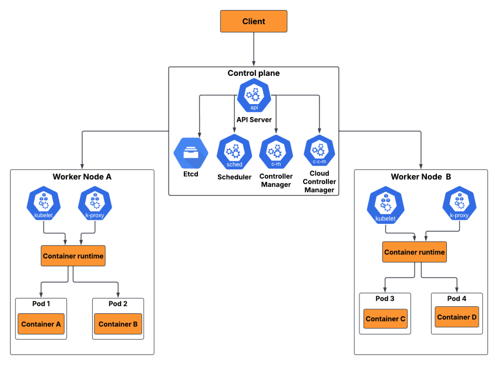

# Kubernetes

## Table of Contents

- [Kubernetes](#kubernetes)
  - [Table of Contents](#table-of-contents)
  - [Introduction](#introduction)
  - [Components](#components)
    - [Control Plane (Master)](#control-plane-master)
    - [Data Plane (Worker)](#data-plane-worker)
    - [Kubernetes Terms](#kubernetes-terms)
  - [Learning Environments](#learning-environments)
  - [Configurations](#configurations)
    - [Context Management](#context-management)
    - [Cluster Setup Requirements (Production Environment)](#cluster-setup-requirements-production-environment)
    - [Installing `containerd` Container Runtime](#installing-containerd-container-runtime)
    - [Firewall Configuration](#firewall-configuration)
    - [Cluster Setup (Production)](#cluster-setup-production)
    - [Namespaces](#namespaces)
    - [Logs \& Port-Forwarding](#logs--port-forwarding)
    - [Labels](#labels)
    - [Annotation](#annotation)
    - [Liveness](#liveness)
    - [Readiness](#readiness)
    - [Replication Management](#replication-management)
      - [Replication Controller](#replication-controller)
      - [ReplicaSet](#replicaset)
      - [DaemonSet](#daemonset)
      - [Job](#job)
      - [CronJob](#cronjob)
    - [Services](#services)
      - [Attaching Services \& Endpoints](#attaching-services--endpoints)
      - [Exposing Services](#exposing-services)
        - [NodePort Services](#nodeport-services)
        - [LoadBalancer Services](#loadbalancer-services)
        - [Ingress Services](#ingress-services)
      - [Headless Services](#headless-services)
    - [DNS Service](#dns-service)
    - [Volume](#volume)
      - [`EmptyDir` Volume](#emptydir-volume)
      - [`HostPath` Volume](#hostpath-volume)
      - [`NFS` Volume](#nfs-volume)
      - [Dynamic Provisioning](#dynamic-provisioning)
        - [`LongHorn`](#longhorn)
    - [Environment Variables](#environment-variables)
    - [Command](#command)
    - [ConfigMap](#configmap)
      - [ConfigMap Sample](#configmap-sample)
    - [Secret](#secret)
      - [Secret Sample](#secret-sample)
    - [MetaData](#metadata)
      - [Kubernetes REST-API](#kubernetes-rest-api)
    - [Useful Tricks](#useful-tricks)
    - [Deployment](#deployment)
    - [StatefulSet](#statefulset)

## Introduction

[Kubernetes](https://kubernetes.io/docs/setup/) is a **container orchestration platform**. Its only job is to:

- Keep your containers running.
- Restart them when they fail.
- Scale them.
- Network them.
- Update them without downtime.

## Components



### Control Plane (Master)

- **API Server**
  - The **entry point**.
  - Everything — `kubectl`, `controllers`, `nodes` — talks to the API server. (`kubectl` converts your commands to REST HTTP requests for interacting with API Server!)
  - You don’t talk to anything else.
  - If this is down, you won’t “feel” the cluster immediately die, but you cannot manage it.

- **etcd**
  - A distributed key-value store.
  - Kubernetes **stores EVERYTHING here**:
    - Pod definitions
    - Secrets
    - ConfigMaps
    - Cluster state
  - If etcd is corrupted, the cluster is dead. This is **the most critical component**.

- **Controller Manager**
  - This is where Kubernetes **enforces the desired state**.
  - Example:
    - You want 3 replicas of a pod. 1 crashes -> Controller notices -> Controller creates a new one
  - It constantly reconciles **“what should be” vs “what is”**.

- **Scheduler**
  - Decides **where a pod should run**.
  - Example questions it answers:
    - Is there enough CPU?
    - Enough memory?
    - Correct node selector?
    - Tolerations/Taints OK?
  - If the scheduler stops working, existing pods continue running, but no new pods get scheduled.

- **Cloud Controller Manager** (optional)
  - Integrates with cloud providers (`AWS`, `GCP`, etc.).
  - Manages:
    - Load balancers
    - Persistent volumes
    - Routes
  - If you’re on bare-metal, this might not exist.

### Data Plane (Worker)

- **Kubelet**
  - The **agent running on every node**.
  - It **receives instructions from the API server**:
    - “Run this pod. Here is the definition.”
  - The kubelet talks to the container runtime to launch containers.
  - If kubelet dies → the node becomes “NotReady”.

- **Container Runtime**
  - `Docker`, `containerd`, `CRI-O` — doesn’t matter.
  - Its job is simple:
    - Pull the image
    - Start the container
    - Report status to kubelet
  - **Kubernetes does NOT run containers itself**.

- **Kube-Proxy**
  - **Manages networking rules** - received from the API server.
  - It ensures:
    - Services get virtual IPs
    - Load balancing to pods works
    - Cluster networking rules are correct
  - If this breaks → traffic routing breaks internally.

### Kubernetes Terms

- **Resource**: Anything that you can manage/control using `kubectl`, e.g. Pod, Service, etc.
- **Pod**:
  - An **isolated wrapper** around containers which enables kubernetes to manage them.
  - The smallest unit of resources in kubernetes.
  - Generally consists of `1` container, sometimes more:
    - in case your containers need to interact with each other **isolated from outside** of the pod.
    - in case your containers need to **start/stop** together
    - in case your containers need to **scale** together
  - Each pod has a `VI - Virtual Interface` for connecting/interacting with other pods.
- **ReplicaSet**: Keeps a number of pods running.
- **Deployment**: Manages ReplicaSets + rolling updates.
- **StatefulSet**: Manages ordered, persistent workloads (databases).
- **DaemonSet**: Runs one pod per node (logging agents, node exporters).
- **Job / CronJob**: One-time or scheduled workloads.
- **Service**: Network abstraction for pods.
- **Ingress**: Routing from outside → inside cluster (HTTP/HTTPS).
- **ConfigMap / Secret**: Configuration and sensitive data.
- **PersistentVolume / PersistentVolumeClaim**: Storage.

## Learning Environments

- [Kind](https://kind.sigs.k8s.io/docs/user/quick-start/)
- [Minikube](https://minikube.sigs.k8s.io/docs/start/)
- [Kubeadm](https://kubernetes.io/docs/setup/production-environment/tools/kubeadm/install-kubeadm/)

## Configurations

### Context Management

- Kubectl configuration file: **`~/.kube/config`** or **`/root/.kube/config`**

```yaml
apiVersion: v1 # using version 1 of APIs for interacting with API Server
clusters: # List of current configured clusters and each ones name
  - cluster: # cluster configuration info
      certificate-authority: /home/malekpour/.minikube/ca.crt # This key is used for connecting to cluster using TLS
      extensions:
        - extension:
            last-update: Tue, 09 Dec 2025 20:16:34 +0330
            provider: minikube.sigs.k8s.io
            version: v1.37.0
          name: cluster_info
      server: https://192.168.49.2:8443 # Cluster's server address
    name: minikube # cluster's name
contexts: # context informs kubectl how to connect to a cluster (in which namespace and by using which user)
  - context:
      cluster: minikube
      extensions:
        - extension:
            last-update: Tue, 09 Dec 2025 20:16:34 +0330
            provider: minikube.sigs.k8s.io
            version: v1.37.0
          name: context_info
      namespace: default
      user: minikube
    name: minikube # context's name
current-context: minikube # Current active context of kubectl (by changing this to another context, you can update the default context of kubectl!)
kind: Config
preferences: {}
users: # List of users
  - name: minikube # user's name
    user:
      client-certificate: /home/malekpour/.minikube/profiles/minikube/client.crt # certificate for connecting to cluster
      client-key: /home/malekpour/.minikube/profiles/minikube/client.key # key for connecting to cluster
```

- If you have other clusters in other servers, you can add their configuration (IP & Port, public key - certificate) and define a context for connecting to them in your configured namespace and by using the valid user

### Cluster Setup Requirements (Production Environment)

- `kubeadm`: the command to bootstrap the cluster. (You need [`kubeadm`](https://kubernetes.io/docs/setup/production-environment/tools/kubeadm/) on both master and worker nodes for setting up your cluster.)
- `kubelet`: the component that runs on all of the machines in your cluster and does things like starting pods and containers. (You need `kubelet` on both master and worker nodes)
- `kubectl`: the command line util to talk to your cluster. (You only need `kubectl` on your master nodes.)
- Choose your `kubeadm`, `kubectl` and `kubelet` based on your `kubernetes` version!

- Now you can update your nodes' name using `hostnamectl set-hostname <desired-name>` command.
- Then your should define corresponding DNS records for your nodes in order to let them communicate with each other
- You can setup a DNS service like `bind` and connect it to your kubernetes or you can directly define your DNS records in each node:

```sh
vim /etc/hosts

# defined your desired node IP and host name
<node-IP-address> <node-hostname>
```

- below commands are required to be run on both master and worker nodes!
- Install required kernel headers (Since kubernetes does not use `iptables`, instead it uses Linux `IP-route` directly and adds some rules to the `iptables`)

```sh
# Debian kernel
sudo apt install kernel-devel-$(uname -r)

# Red-Hat kernel
sudo dnf install kernel-devel-$(uname -r)
```

- Now load kubernetes required kernel modules at runtime, like `bridge` and `port-forwarding` tools which are used mostly by `kube-proxy`

```sh
# Enable netfilter (iptables/nftables) on Linux bridge traffic.
sudo modprobe br_netfilter

# Enable IP Virtual Server (IPVS): Kernel-level Layer-4 load balancing, Faster and more scalable than iptables
sudo modprobe ip_vs

# Add Round-Robin scheduling to IPVS.
sudo modprobe ip_vs_rr

# Add Weighted Round-Robin scheduling.
sudo modprobe ip_vs_wrr

# Add Source Hashing (Same client IP → same backend pod): sticky sessions (session affinity)
sudo modprobe ip_vs_sh

# Enable OverlayFS, a union filesystem. (Container runtimes use OverlayFS to: Mount image layers efficiently, Avoid copying entire filesystems per container, Reduce disk usage and startup time)
sudo modprobe overlay
```

- Persist loaded kernel modules in kubernetes configuration

```sh
cat > /etc/modules-load.d/kubernetes.conf << EOF
br_netfilter
ip_vs
ip_vs_rr
ip_vs_wrr
ip_vs_sh
overlay
EOF
```

- Enable IP-forwarding in kubernetes configuration

```sh
cat > /etc/sysctl.d/kubernetes.conf << EOF
net.ipv4.ip_forward = 1
net.bridge.bridge-nf-call-ip6tables = 1
net.bridge.bridge-nf-call-iptables = 1
EOF
```

- Now Refresh your configurations in order to apply them

```sh
sysctl --system
```

- Disable `swap-memory` (it can cause unexpected behavior and errors while using kubernetes)

```sh
# Disable swap-memory
sudo swapoff -a

# Comment out all swap entries in /etc/fstab, effectively disabling swap on system boot
sed -e '/swap/s/^/#/g' -i /etc/fstab

# check swap memory status
free -h
# swap-memory dedicated storage should be 0 now!
```

### Installing `containerd` Container Runtime

- Container Runtime is responsible for pushing/pulling images, managing repository, network and storage.
- `containerd` [releases](https://containerd.io/releases/), choose a stable and compatible version based on your kubernetes version
- Add docker repository to your OS package manager:

```sh
# Red-Hat - Docker
vim /etc/yum.repos.d/yum-docker.repo

# yum-docker.repo
[docker-ce]
name=centos $releasever - Docker-CE
baseurl=http://<repository-IP>:<repository-port>/repository/yum-docker/
gpgcheck=0
enabled=1
# local repository is a proxy for https://download.docker.com/linux/centos/9/x86_64/stable

# Debian
vim /etc/apt/sources.list.d/docker-ce.list

# docker-ce.list
deb [trusted=yes] http://<repository-IP>:<repository-port>/repository/apt-docker/ /
# updated this local repository according to your debian-based OS

# ------------------------------------------------------------------------------------------

# Red-Hat - Kubernetes
vim /etc/yum.repos.d/kubernetes.repo

# kubernetes.repo (Directly connected to internet) -> kubernetes.repo.old for disabling repo, add a suffix to its name like .old or .backup
[kubernetes]
name=kubernetes
baseurl=https://pkgs.k8s.io/core:/stable:/v1.32/rpm/
enabled=1
gpgcheck=1
gpgkey=https://pkgs.k8s.io/core:/stable:/v1.32/rpm/repodata/repomd.xml.key
exclude=kubelet kubeadm kubectl cri-tools kubernetes-cni
# update kubernetes version based on your installed kubernetes

# kubernetes.repo (Connected to local repository)
[kubernetes]
name=centos $releasever - Docker-CE
baseurl=http://<repository-IP>:<repository-port>/repository/yum-kubernetes/
gpgcheck=0
enabled=1
# local repository is a proxy for https://pkgs.k8s.io/core:/stable:/v1.32/rpm/

# ------------------------------------------------------------------------------------------

# Red-Hat - Packages
vim /etc/yum.repos.d/yum-repo.repo

[appstream]
name=centos $releasever - AppStream
baseurl=http://<repository-IP>:<repository-port>/repository/yum-repo/AppStream/x86_64/os/
gpgcheck=0
enabled=1
# local repository is a proxy for https://mirror.stream.centos.org/9-stream/

[baseOs]
name=centos $releasever - BaseOs
baseurl=http://<repository-IP>:<repository-port>/repository/yum-repo/BaseOs/x86_64/os/
gpgcheck=0

[ha]
name=centos $releasever - HA
baseurl=http://<repository-IP>:<repository-port>/repository/yum-repo/HighAvailability/x86_64/os/
gpgcheck=0
```

- Now install `containerd`

```sh
# Red-Hat
yum install containerd.io

# Check Installation
crictl
# outputs available commands for interacting with containerd
```

- Default `containerd` configuration file: `/etc/containerd/config.toml`
- Advanced configuration of containerd: `sudo sh -c "containerd config default > /etc/containerd/config.toml"`
- Now update this advanced configuration for using local registry and interacting with kubernetes:

```sh
vim /etc/containerd/config.toml
```

```toml
<!-- Enable runc SystemCgroup -->
[Plugins."io.containerd.grpc.v1.cri".containerd.runtimes.runc.options]
  ...
  SystemdCgroup = true

<!-- Update Registry Mirrors -->
[Plugins."io.containerd.grpc.v1.cri".registry.mirrors]
  [Plugins."io.containerd.grpc.v1.cri".registry.mirrors."quay.io"]
    endpoint = ["http://<repository-IP>:<repository-port>"]
  [Plugins."io.containerd.grpc.v1.cri".registry.mirrors."docker.io"]
    endpoint = ["http://<repository-IP>:<repository-port>"]
  [Plugins."io.containerd.grpc.v1.cri".registry.mirrors."k8s.gcr.io"]
    endpoint = ["http://<repository-IP>:<repository-port>"]
  [Plugins."io.containerd.grpc.v1.cri".registry.mirrors."*"]
    endpoint = ["http://<repository-IP>:<repository-port>"]
  [Plugins."io.containerd.grpc.v1.cri".registry.mirrors."gcr.io"]
    endpoint = ["http://<repository-IP>:<repository-port>"]
  [Plugins."io.containerd.grpc.v1.cri".registry.mirrors."docker.elastic.io"]
    endpoint = ["http://<repository-IP>:<repository-port>"]

<!-- You should define a proxy repository for each one of these registries and them include them inside a group repository -->
```

```sh
# restart containerd for applying changes
systemctl restart containerd.service

# if containerd default service was not created, you should enable it
systemctl enable --now containerd.service
```

### Firewall Configuration

```sh
# Checking firewall status
systemctl status firewalld.service

# Stop & Disable your firewall - Not Recommended!
systemctl stop firewalld.service
systemctl disable firewalld.service

# Instead of stopping & disabling your firewall manage kubernetes required ports!
```

- `Kubernetes` required ports:
  - `6443` -> Kubernetes API Server: Open to control-plane nodes and admins / CI. DO NOT EXPOSE PUBLICLY!
  - `2379` -> client traffic (API server → `etcd`)
  - `2380` -> peer traffic (`etcd` ↔ `etcd`)
  - `10250` -> `kubelet`
  - `10251` -> `kube-scheduler`
  - `10252` -> `kube-controller-manager`
  - `10255` -> `kubelet` read-only port
  - `5473`

### Cluster Setup (Production)

```sh
# Enable kubelet service
systemctl enable --now kubelet.service

# Check kubelet status
systemctl status kubelet.service

# if kubelet was experiencing FAILURE you can check its logs using
journalctl -r
# ignore not found error related to /var/lib/kubelet/config.yaml
# above file will be created after kubernetes installation
```

- Now install kubernetes

```sh
# List of required images for setting up kubernetes
kubeadm config images list

# Download kubernetes required images
kubeadm config images pull
# stored these images in your local repository for kubernetes setup in no-internet environments

# First, run this command on your master node
kubeadm init --pod-network-cidr=10.244.0.0/16
# --pod-network-cidr -> configuration of pods internal network
# -v6 -> by adding this flag you can run your kubernetes setup in debug mode to fix its errors

# Run after installation of kubernetes (prompted in logs!)
mkdir -p $HOME/.kube
sudo cp -i /etc/kubernetes/admin.conf $HOME/.kube/config
sudo chown $(id -u):$(id -g) $HOME/.kube/config

# you will also be prompted with the command for joining worker nodes!

# Check your nodes
kubectl get nodes
```

- Now you need to manage kubernetes internal network by using a `CNI - Container Network Interface`
- `CNI` is a tool for container network and security management
- You can use different tools for fulfilling this purpose like:
  - [`Calico`](https://www.tigera.io/project-calico/)
  - `Flannel`
  - `Canal`
  - `Cilium`

- `Calico` [quickstart installation](https://docs.tigera.io/calico/latest/getting-started/kubernetes/quickstart)
- If your server is not connected to internet, you can save `tigera-operator.yaml` and `custom-resources.yaml` in your server.
- If you have multiple network interfaces - `NIC`, you must determine which one of them should be used for internal network under `Calico`:

```yaml
calicoNetwork:
  # ...
  nodeAddressAutodetectionV4:
    interface: <NIC-name(e.g. ens33)>
```

- update `cidr` address in `custom-resources.yaml` file based on the address you provided when using `kubeadm` init command (e.g. `10.244.0.0/16`) and the follow below instructions ([How to customize `Calico`](https://docs.tigera.io/calico/latest/getting-started/kubernetes/self-managed-onprem/config-options#how-to)):

```sh
kubectl create -f tigera-operator.yaml
kubectl create -f custom-resources.yaml
```

- Checking kubernetes pods:

```sh
# get pods in all namespaces
kubectl get pod -A
# After successful setup all of the pods should have 'Running' STATUS and '1/1` READY!
```

- Now your single-master kubernetes cluster is ready! (you can also setup a multi-master kubernetes cluster with a little bit more configuration!)
- Let's run some pods to test our cluster:

```sh
# Creating an nginx pod without any manifest
kubectl run nginx-pod --image=nginx --restart=Never --port=80 -n default

# check nginx status
kubectl get po
kubectl get pod

# check cluster services
kubectl get svc
kubectl get service
# you can find your cluster IP here!

# Exposing nginx-pod by creating nginx service
kubectl expose pod nginx-pod --type=NodePort --port=80 --name=nginx-service
# Now you can access your nginx service by using your public-IP on port 80!

# deleting nginx pod
kubectl delete po nginx-pod

# deleting nginx service
kubectl delete svc nginx-service
```

- Now let's create a manifest for nginx, called `nginx.yaml`:

```yaml
apiVersion: v1
kind: Pod
metadata:
  name: nginx-pod
  labels:
    app: nginx
spec:
  containers:
    - name: nginx-container
      image: nginx:latest
      ports:
        - containerPort: 80
```

```sh
# creating nginx pod by its manifest
kubectl create -f nginx.yaml

# deleting manifest's pod
kubectl delete -f nginx.yaml
```

### Namespaces

- `Namespace`: is a high level wrapper for isolating different resources in kubernetes (similar to Linux namespaces)

```sh
# list available namespaces
kubectl get namespace
kubectl get ns
# kubernetes considers 'default' namespace when you are getting different resources

# Create namespace
kubectl create ns <namespace>

# Delete namespace
kubectl delete ns <namespace>
# Every corresponding resource of the desired namespace will be deleted!

# Delete all pods inside a namespace
kubectl delete po -n <namespace> --all

# Delete all resources inside a namespace (almost all resource)
kubectl delete all --all -n <namespace>

# Getting pods by using namespace filtering
kubectl get po --namespace <namespace>
kubectl get po -n <namespace>

# Getting all of the available pods in every namespace
kubectl get po -A

# Get a specific pod manifest (in different formats)
kubectl get po <pod> -n <namespace> -o yaml
kubectl get po <pod> -n <namespace> -o json
```

### Logs & Port-Forwarding

```sh
# Check pod logs
kubectl logs -n <namespace> <pod>

# Editing pod
kubectl po -n <namespace> <pod>
# Some properties are immutable and you can not edit them (e.g. container-name)
# After saving your changes, this pod will be restarted and your changes will apply!

# Check a container's logs in a specific pod
kubectl logs -n <namespace> <pod> -c <container>
# -f -> follow flag in order to follow generated logs

# Exposing your pod by port-forwarding
kubectl port-forward -n <namespace> <pod> <server-port>:<pod-port>
# Now your pod's internal port is accessible through server's port (from inside your server!)
# You can quickly test your pod by port-forwarding and curl command
# [C-c] will End your port-forwarding!
```

### Labels

- `Label` is a key-value pair used for **categorizing** your resources(e.g. pods, nodes) in the same namespace!

```yaml
apiVersion: v1
kind: Pod
metadata:
  name: nginx-pod
  labels: # define labels here (key: value)
    app: nginx
    rel: beta
spec:
  nodeSelector: # Filter for node selection on deployment
    disk: ssd # label-key: label-value for filtering nodes
  containers:
    - name: nginx-container
      imagePullPolicy: Always
      image: nginx:latest
      ports:
        - containerPort: 80
          protocol: TCP
```

```sh
# Apply your changes
kubectl apply -f nginx.yaml

# List pods + labels
kubectl get po -n <namespace> --show-labels

# List pods + nodes (and complementary data)
kubectl get po -n <namespace> -o wide

# List pods + showing specific label(s) value
kubectl get po -n <namespace> -L <label-key>
kubectl get po -n <namespace> -L <label-key>,<label-key2>

# Filtering pods based on labels
kubectl get po -n <namespace> -l <label-key>
# pods without specified label will be excluded

kubectl get po -n <namespace> -l '!<label-key>'
# pods with specified label will be excluded

# Filtering pods/nodes based on label and its value
kubectl get po -n <namespace> -l <label-key>=<label-value>
kubectl get nodes -l <label-key>=<label-value>

# Filtering pods with combined label filters
kubectl get po -n <namespace> -l '!<label-key>',<label-key>=<label-value>

# Add label to pod
kubectl label po -n <namespace> <pod> key=value --overwrite
# If your label already exists you must use --overwrite flag (Caution: your previous label(s) will be overwritten!)
# If you label is new, you don't need overwrite flag

# Add label to node
kubectl label nodes <node> key=value

# Delete pods based on labels
kubectl delete po -n <namespace>  -l <label-key>=<label-value>
```

### Annotation

- `Annotation` is similar to label, but annotations are used for long-content key-value pairs.
- Used for:
  - Documenting project authors
  - Using `Beta` release features based on annotations

```sh
# Add annotation to pod
kubectl annotate po -n <namespace> key=value

# Get detailed information about pod
kubectl describe po -n <namespace> <pod>
# 'Events' section is very useful for debugging pods when using describe command
```

### Liveness

- Liveness is controlled by defining a health-check for your pod
- Consider defining liveness criteria based on the rule of thumb that a restart can resolve your liveness issue
- Types of liveness-probe:
  - HTTP: Sending a GET request to an endpoint and check its response
  - TCP: Establish a TCP connection to an address and check its connection
  - Exe-C: Check Exit status of a command after execution
- Best practices of health-check:
  - Keep health-check process light, do not include heavy processing for health-checks
  - Make health-check endpoint public, do not require authentication for health-check
  - Do not rely on external components and infra-structures for health-check (restarting your pod won't resolve external components failure)
  - Include some delay before restarting your pod

```yaml
apiVersion: v1
kind: Pod
metadata:
  name: nginx-pod
    app: nginx
spec:
  containers:
    - name: nginx-container
      imagePullPolicy: Always
      image: nginx:latest
      livenessProbe: # Defining liveness probe (immutable)
        httpGet: # liveness probe type
          path: / # where to call for health-check
          port: 80
        initialDelaySeconds: 15 # delay before restarting pod after liveness check failure
      ports:
        - containerPort: 80
          protocol: TCP
```

```sh
# watch for pods status change
watch kubectl get po
kubectl get po -w
# -w: is the watch flag to follow status changes

# check container events and health-check status
kubectl describe po <pod>

# when your pod restarts a new container is created; in order to check previous container logs, run
kubectl logs <pod> --previous
```

### Readiness

- In production environments, a running service should only add a pod to its selected pods when its ready; for this matter readiness is used in order to determine a pod is ready to be used or not (since application startup might take some time).
- Best practice: define both `liveness` and `readiness` for your pods.

### Replication Management

#### Replication Controller

- `Replica Controller`: Manages pod replication for high-availability by making sure there always a specified number of replicas are running simultaneously in cluster
- A `Replica Controller` consists of:
  - `Pod Selector`: criteria for selecting certain pods to be managed by this replica-controller
  - `Replicas`: Holds the number of replicas
  - `Pod Template`: A sample template for replication of pods, holding pod's specifications

- Now let's create a manifest for nginx replica controller, called `nginx-rc.yaml`:

```yaml
apiVersion: v1
kind: ReplicationController
metadata:
  name: nginx-rc
    app: nginx
spec:
  replicas: 2 # number of replicas
  selector:
    app: item # label criteria for selecting pods
  template: # signature for replicating pods
    metadata: # name will be created by replica-controller
      labels:
        app: item # must match the selector criteria
      spec:
        containers:
        - name: nginx
          image: nginx
          ports:
          - containerPort: 80
```

```sh
# Create replica controller
kubectl apply -f nginx-rc.yaml

# List replica-controllers
kubectl get rc
# if you change a pod labels, replica controller won't notice until a restart happens!

# Force deleting a pod
kubectl delete po <pod> --force
# This can be a bad-practice since it prevents graceful shutdown and resources might not get freed!

# Delete replica controller
kubectl delete rc <replica-controller>
```

#### ReplicaSet

- `ReplicaSet` is a more modern replication controller which provides more options for replication management, like:
  - Defining multiple labels for pod selection
  - Defining expressions which provide more advanced filtering for pod selection
- ReplicaSets focus on maintaining a defined number of pod replicas across the cluster. Their primary goal is to enhance availability and load balancing by ensuring multiple instances of an application run simultaneously.

```yaml
apiVersion: apps/v1
kind: ReplicaSet
metadata:
  name: nginx-rs
    app: nginx
spec:
  replicas: 2 # number of replicas
  selector:
    matchLabels: # you can define multiple labels
      app: item
  template: # signature for replicating pods
    metadata: # name will be created by ReplicaSet
      labels:
        app: item # must match the selector criteria
      spec:
        containers:
        - name: nginx
          image: nginx
          readinessProbe: # Defining readiness probe
            exec: # readiness probe type
              command:  # commands to be executed for checking readiness
              - ls
              - /var/ready # you can manually create this folder in your pods to make them ready!
          ports:
          - containerPort: 80
            name: http
          - containerPort: 443
            name: https
```

```yaml
apiVersion: apps/v1
kind: ReplicaSet
metadata:
  name: nginx-rs
    app: nginx
spec:
  replicas: 2 # number of replicas
  selector:
    matchExpressions: # Expressions provides more control on your selector criteria
    - key: app
      operator: In # you can use other operators like not-in, exist, etc.
      values:
        - item
  # ...
```

```sh
# Creating ReplicaSet
kubectl apply -f nginx-rs.yaml

# Creating readiness sample directory for pods in order to make them ready
kubectl exec -it -n <namespace> <pod> -- touch /var/ready

# Check your pods' status
kubectl get po -n <namespace>
```

#### DaemonSet

- `DaemonSet` ensures that **one instance** of a specific pod runs on **all or selected nodes** in a cluster. This is ideal for tasks like logging, monitoring, or other node-specific services.
- With DaemonSets, you can guarantee that critical services operate consistently across your entire infrastructure.

```yaml
apiVersion: apps/v1
kind: DaemonSet
metadata:
  name: nginx-ds
    app: nginx
spec:
  selector:
    matchLabels: # you can define multiple labels
      app: item
  template:
    metadata:
      labels:
        app: item # must match the selector criteria
      spec:
        nodeSelector: # label criteria for selecting deployment nodes (if not mentioned all of the nodes are considered)
          disk: ssd
        containers:
        - name: nginx
          image: nginx
```

#### Job

- `Job` runs a specific pod in order to fullfil a job and then updates its status to Completed (freeing occupied resources)

```yaml
apiVersion: batch/v1
kind: Job
metadata:
  name: hello
spec:
  completions: 5 # Total number of pods for running this job
  parallelism: 2 # Total number of concurrent running pods for job execution
  template:
    metadata:
      labels:
        app: item
      spec:
        containers:
          - name: hello
            image: busybox:1.28
            imagePullPolicy: IfNotPresent
            command:
              - /bin/sh
              - -c
              - date; echo Hello from the kubernetes cluster
        restartPolicy: OnFailure # to prevent jobs from restarting on completion do not use Always policy for restart!
```

```sh
# Create replica controller
kubectl apply -f job.yaml

# List running jobs
kubectl get jobs.batch

# Checking job's pod status
kubectl get po
# Successful jobs have 'Completed' status!
```

#### CronJob

- `CronJob` creates a job at a specific time in order to fullfil a cron-job and then updates job-pod's status to Completed (freeing occupied resources)

```yaml
apiVersion: batch/v1
kind: CronJob
metadata:
  name: hello
spec:
  # Minute(0-59) Hour(0-23) Day-of-the-month(1-31) Month(1-12) Day-of-the-week(0-6 / Sunday-Saturday / sun-sat)
  schedule: "0 3 * * 1" # Runs every Monday at 3:00 A.M.
  jobTemplate: # Template for creating a job
    spec:
      template: # Template for job's pod
        spec:
          containers:
            - name: hello
              image: busybox:1.28
              imagePullPolicy: IfNotPresent
              command:
                - /bin/sh
                - -c
                - date; echo Hello from the kubernetes cluster
          restartPolicy: OnFailure # to prevent jobs from restarting on completion do not use Always policy for restart!
```

```sh
# Create replica controller
kubectl apply -f cron-job.yaml

# List running jobs
kubectl get cronjobs.batch

# Checking cron-job's pod status
kubectl get po
# Successful jobs have 'Completed' status!
```

### Services

- `Service` resource is a wrapper around pods which can act like reverse-proxy and load-balancer
- Service enables clients from outside the kubernetes OS host and network to interact with pods
- Now lets connect replicas to a service:

```yaml
apiVersion: apps/v1
kind: ReplicaSet
metadata:
  name: nginx-rs
  namespace: nginx-ns
spec:
  replicas: 3
  selector:
    matchExpressions:
      - key: app
        operator: In
        values:
          - item
  template:
    metadata:
      labels:
        app: item
      spec:
        containers:
          - name: nginx
            image: nginx
            ports:
              - containerPort: 80
                name: http # defining named-port
              - containerPort: 443
                name: https
```

```yaml
apiVersion: v1
kind: Service
metadata:
  name: nginx-srv
  namespace: nginx-ns # must match with the pods' namespace
spec:
  # Session Affinity enables routing each client requests to the same pod every-time! (Default: None)
  sessionAffinity: ClientIP # Using client-IP for sticky session
  ports:
    - port: 8080 # Service's port for client to interact with service
      targetPort: 80 # Pod's port which will be used by service for interacting with them
      name: http8080
    - port: 8085
      targetPort: https # Pod's named-port which will be used by service for interacting with them (best practice)
      name: https8085
  selector: # defining label criteria for pod discovery
    app: item
```

```sh
# Order of applying replication and services manifest does not matter!
kubectl apply -f nginx-rs.yaml
kubectl apply -f nginx-srv.yaml

# Check for pod's IP
kubectl describe po <pod> -n <namespace>
kubectl get po -n <namespace> -o wide

# list services
kubectl get svc -n <namespace>

# Check service details
kubectl describe svc -n <namespace> <service>
# If you do not expose/proxy your service, you can call it internally from its OS for debugging!
```

- Debug services internally (you can use images like `curlimages/curl`):

```yaml
apiVersion: v1
kind: Pod
metadata:
  name: test
  namespace: nginx-ns
spec:
  containers:
    - name: test
      image: curlimages/curl
      command: "/bin/sh", "ec", "while :; do echo '.'; sleep 5 ; done" # entrypoint command to keep the pod running
```

```sh
# run test/debug pod
kubectl apply -f nginx-test.yaml

# connect to pod for calling/testing services interactively
kubectl exec -it -n <namespace> <pod> -- sh
kubectl exec -it -n <namespace> <pod> -- /bin/sh
# curl <service-IP/name>:<service-port>
# You can check for available service names which will be resolved by kubernetes-DNS in '/etc/resolv.conf'!

# call your service directly from pod's shell
kubectl exec -it -n <namespace> <pod> -- curl <service-IP>:<service-port> -v
kubectl exec -it -n <namespace> <pod> -- curl <service-name>:<service-port>

# if your test/debug pod was not in the same namespace, you can still call your desired service like this
kubectl exec -it <pod> -- curl <service-name>.<service-namespace>:<service-port>
# only works if access to your desired namespace is not limited!

# Removing test/debug pod
kubectl delete -f nginx-test.yaml (--force)
# You might need to use --force flag since this pod's command never finishes for graceful shutdown!
```

#### Attaching Services & Endpoints

- You can also check for available endpoints in your desired namespace:

```sh
# List endpoint resources
kubectl get endpoints -n <namespace>
```

- You can also create a service and connect it to external endpoints:

```yaml
# external-service.yaml
apiVersion: v1
kind: Service
metadata:
  name: external-service # service's name must match endpoint's name to be attached to it!
  namespace: external
spec:
  type: ExternalName # Defining a name record for this service attached endpoints (optional)
  externalName: api.company.org
  ports:
    - port: 80
```

```yaml
# external-endpoints.yaml
apiVersion: v1
kind: Endpoints # endpoint's name must match service's name to be attached to it!
metadata:
  name: external-service
  namespace: external
subsets:
  - addressees:
      - ip: 192.168.230.129
      - ip: 192.168.230.132
    ports:
      - port: 80
```

```sh
# Creating attached service and endpoint
kubectl create -f external-endpoints.yaml
kubectl create -f external-service.yaml
```

#### Exposing Services

- Services which are exposed has 3 types:
  - `NodePort` Services
  - `LoadBalancer` Services
  - `Ingress` Services

##### NodePort Services

- `NodePort` services are the most used and useful type for exposing services
- The best practice would be to place an external **load-balancer** (e.g. `HA-Proxy`, `Nginx` or `F5` for large companies) before requests can reach the exposed NodePort service, and received requests are load-balanced to the available nodes which are exposed by the NodePort service!

```yaml
apiVersion: v1
kind: Service
metadata:
  name: nginx-np
  namespace: nginx-ns
spec:
  type: NodePort
  ports:
    - port: 8000
      targetPort: http
  selector:
    app: item
```

```sh
# Create NodePort service
kubectl create -f nginx-svc-np.yaml

# List namespace services
kubectl get svc -n <namespace>
# NodePort Service's port is bound to an external port which can be accessed from outside!
# Now all of the requests are routed to the desired service whether received by worker nodes or mater nodes!
```

##### LoadBalancer Services

- `LoadBalancer` service acts as a load-balancer for received requests (if you use a good load-balancer, you won't really need this type of services!)

```yaml
apiVersion: v1
kind: Service
metadata:
  name: nginx-lb
  namespace: nginx-ns
spec:
  type: LoadBalancer
  ports:
    - port: 8000
      targetPort: http
  selector:
    app: item
```

```sh
# Create LoadBalancer service
kubectl create -f nginx-svc-np.yaml

# List namespace services
kubectl get svc -n <namespace>
# LoadBalancer service is now PENDING, cause it requires an external-IP in order to be accessed!
# LoadBalancer services have a NodePort service in their underlying layers which is used for routing their traffic to exposed nodes!

# Some load-balancers (e.g. Metal-LB) are compatible with kubernetes internal network to be exposed but
# they are not very useful, since they are not production ready or stable!

# Metal-LB only works with BGP configuration which is another overhead for network configuration of your nodes, so
# it really doesn't worth the headache to use these type of services for production/deployment!
# Now if BGP is not configured, all of the received requests are routed to a single node and then they will
# load-balance between your nodes which creates a bottle-neck in your network and considered a bad-practice!
```

##### Ingress Services

- `Ingress` is like a gateway which provides options like security (e.g. `TLS`) and routing to desired services' pods (based on the `URL` path).
- Ingress services are the least useful type for exposing services (but widely used in Iran)
- Ingress is not very useful since in its underlying layer it has a load-balancer where are the traffic are routed there and then load-balanced between nodes which creates a bottle-neck and considered as a bad-practice!
- Ingress will probably gets deprecated and replaced by the `Gateway` resource which is already available in kubernetes (`Gateway` is not yet fully stable, but if you want to use it, it's better to use service-meshes like `XTO` or `LinkerD`)

```yaml
# minimal-ingress.yaml
apiVersion: networking.k8s.io/v1
kind: Ingress
metadata:
  name: minimal-ingress
  namespace: nginx-ns
  annotations:
    nginx.ingress.kubernetes.io/rewrite-target: /
spec:
  ingressClassName: nginx-example # Connects ingress service to its corresponding ingress-controller (e.g. nginx, HA-proxy, etc.)
  rules:
    - http:
        paths:
          - path: /test
            pathType: Prefix # This path requests must start with 'test' prefix
            backend:
              service:
                name: nginx-np # nginx NodePort service
                port:
                  number: 8000
```

```sh
# Run ingress service
kubectl apply -f minimal-ingress.yaml

# List ingress services
kubectl get ingress -n <namespace>
# Now you can not call your ingress service since it is not bound to any address!
# In order to access your ingress service, install an ingress-controller like: Nginx Ingress Controller (HINT: use install with manifest)

# List ingress controllers
kubectl get ingressClasses.networking.k8s.io
# Now you need to update ingressClassName in your ingress service manifest based on your running ingress controller
# It's recommended to create your ingress controller before your ingress service in order to prevent editing and configuration overheads!!

# For further study you can check ingress-controller 'cafe' project example.
# Again since your ingress doesn't have an 'External-IP'; it can not be called from outside the client; you require some services like AWS, Azure or MetalLB in order to dedicate an external-IP to your ingress service!
```

#### Headless Services

- In order to route your traffic to all of your available pods you should use a `headless` service which doesn't get an IP address which means your service is not bound to any specific node and connects to all of available endpoints corresponding to your nodes and namespace.
- By using a `headless` service, incoming requests are **directly** load-balanced between your nodes, instead of passing through a intermediatory `service proxy` first.
- By default, a headless service uses `round-robin` pattern for load-balancing incoming requests.

```yaml
apiVersion: v1
kind: Service
metadata:
  name: nginx-headless
  namespace: nginx-ns
spec:
  clusterIP: None # Makes your service headless
  ports:
    - port: 8000
      targetPort: http
  selector:
    app: item
```

```sh
# Creating a headless service
kubectl apply -f nginx-headless.yaml

# Running a DNS utility pod without a manifest (with a infinite loop command)
kubectl run dnsutils -n <namespace> --image=tutum/dnsutils --command -- sleep infinity
# Now you can use this pod to run DNS lookup commands

# Running a DNS lookup command on your headless service
kubectl exec dnsutils -n <namespace> -- nslookup nginx-headless
# As a result you should see all of the available pods based on your service selector criteria!
```

### DNS Service

```sh
# List all available service
kubectl get svc -A
# 'kube-dns' service in 'kube-system' namespace is your kubernetes DNS server for resolving names and addresses!

# If you have multiple networks or DNS servers where your kubernetes cluster is deployed, you must register them in its DNS service:
kubectl get cm -n kube-system
# Register other networks and DNS services in 'coredns' config!

# Check coredns manifest
kubectl get cm -n kube-system coredns -o yaml
```

### Volume

- [`Volumes`](https://kubernetes.io/docs/concepts/storage/volumes/) are used for persisting pod's data
- Different types of volumes are available, which one to chose is dependent on your requirements
- Volumes can be shared between pods.
- Similar to ingress controllers you can also use external tools like `CEPH` which acts as a storage provisioning tool and manages your volumes. (Recommended for large scale companies)

#### `EmptyDir` Volume

- A simple temporary directory for storing pod's data which is transient and it's status depends on pod's lifecycle and ends with it.

```yaml
apiVersion: apps/v1
kind: ReplicaSet
metadata:
  name: nginx-rs
  namespace: nginx-ns
spec:
  replicas: 2
  selector:
    matchExpressions:
      - key: app
        operator: In
        values:
          - item
  template:
    metadata:
      labels:
        app: item
      spec:
        containers:
          - name: nginx
            image: nginx
            volumeMounts: # Mounting a volume to a defined path
              - name: html
                mountPath: /usr/share/nginx/html
                readOnly: true
            ports:
              - containerPort: 80
                name: http
              - containerPort: 443
                name: https
        volumes: # defining an empty-directory volume
          - name: html
            emptyDir: {}
            # emptyDir: # Storing empty directory data on pod's memory instead of disk!
            #   medium: Memory
```

```sh
# Creating ReplicaSet with mounted volume
kubectl apply -f nginx-rs.yaml

# Checking mounted volumes
kubectl describe <pod> -n <namespace>
# you should see something like '/usr/share/nginx/html from html (ro)' in Mounts section!
# Mount structure: <mount path> from <volume> (mode -e.g. read-only)

# Attaching to a specific container's shell in your pod replica-set
kubectl exec -it -n <namespace> <pod> -c <container> -- sh
```

#### `HostPath` Volume

- Directly attaching a host's directory to your pod.
- This type of volume is **not recommended** due to security considerations (Pods should be isolated and do not have any access to their host!).
- Unlike `EmptyDir` volumes, `HostPath` volume is persistent.

#### `NFS` Volume

- Network File Systems are shared in the available network.

#### Dynamic Provisioning

- Dynamic Provisioners are used for **persisting data**, **creating back-ups** and **replicating data**.
- Dynamic Provisioners interact with **`Storage` classes** for managing `Persistent Volume - PV` and `Persistent Volume Claim - PVC` through `Container Storage Interface - CSI Driver`.
- A Dynamic Provisioner interacts with `storage class` in order to create its required `Persistent Volume`; then `Persistent Volume` is created by `CSI Driver` and any pod can request for a specific claim based on its required storage space (e.g. `1GB`) which is defined as a `Persistent Volume Claim` and gets attached to the pod. This storage is provided from the available `Persistent Volume`.
- `PV`s can be access from different name-spaces but `PVC`s are bound to the namespace where they are defined.
- `ACCESS MODES` -> Different type of **access-modes** are available for accessing `PVC`s:
  - `ReadWriteOnce`: only one node can read and write on the volume
  - `ReadWriteMany`: many nodes can read and write on the volume
  - `ReadOnlyMany`: many nodes can only read from the volume
- Depending on your storage provisioner supported access-modes you can manage node's access to volumes.
- `RECLAIM POLICY` determines what happens to `Persistent Volume` when its corresponding `PVC` gets deleted, different policies are:
  - `DELETE`: `PV` gets deleted when its corresponding `PVC` is deleted.
  - `RECYCLE`: only `PV` data gets deleted when its corresponding `PVC` is deleted, `PV` will be still available to be used. (deprecated!)
  - `RETAIN`: `PV` data is preserved when its corresponding `PVC` is deleted; an admin intervention is required for handling retained data. (best practice for sensitive data)
- As a best practice it's recommended to use dynamic provisioners; `LongHorn` for small to almost big sized projects, `Ceph` for enterprise level projects.

##### `LongHorn`

- [`LongHorn`](https://longhorn.io/docs/) is a robust cloud-native storage provisioning tool. ([Installation With Kubectl](https://longhorn.io/docs/latest/deploy/install/install-with-kubectl/))
- You can read its documentation and fine its best practices for managing your desired volumes. ([Create Longhorn Volumes](https://longhorn.io/docs/latest/nodes-and-volumes/volumes/create-volumes/))

```sh
# list persistent volumes
kubectl get pv

# list persistent volume claims
kubectl get pvc
```

### Environment Variables

```yaml
apiVersion: apps/v1
kind: ReplicaSet
metadata:
  name: nginx-rs
  namespace: nginx-ns
spec:
  replicas: 2
  selector:
    matchExpressions:
      - key: app
        operator: In
        values:
          - item
  template:
    metadata:
      labels:
        app: item
      spec:
        containers:
          - name: nginx
            image: nginx
            env: # Defining pod's environment variables
              - name: test
                value: "hi"
              - name: test2
                value: "$(test), bye"
            ports:
              - containerPort: 80
                name: http
```

```sh
# Checking pod's environment variables
kubectl exec -it -n <namespace> <pod> -- env
```

### Command

- Used for defining/overwriting pod's Entrypoint executable command/path and its corresponding arguments (Immutable).

```yaml
apiVersion: apps/v1
kind: ReplicaSet
metadata:
  name: nginx-rs
  namespace: nginx-ns
spec:
  replicas: 2
  selector:
    matchExpressions:
      - key: app
        operator: In
        values:
          - item
  template:
    metadata:
      labels:
        app: item
      spec:
        containers:
          - name: nginx
            image: nginx
            command: ["echo"] # Entrypoint (command) of pod
            args: ["hello"] # Arguments which are passed to the Entrypoint (like CMD in Docker)
            ports:
              - containerPort: 80
                name: http
```

### ConfigMap

- `ConfigMap` is like a volume storage which is used for management of pod's configuration
- Unlike `Volume`, one of the benefits of using a `ConfigMap` is **applying live updates** without restarting your containers.
- In order to make your app fully cloud-native, consider enabling a **config reloading** mechanism to apply configuration updates!

```sh
# Creating config-map
# Directly defining key-value pairs using 'literal'; you can also pass multiple literals
kubectl create configmap <config-name> --from-literal=port=8888
# Defining key-value pairs using 'file'
kubectl create configmap <config-name> --from-file=nginx.conf
kubectl create configmap <config-name> --from-file=./ # using all files from current directory
# You can also combine 'literal' and 'file' commands.
# By using namespace flag (-n), configmaps can be defined in your desired namespace.

# List config-maps
kubectl get cm

# Check config-map details (YAML format)
kubectl get cm <config-name> -o yaml

# Check config-map details
kubectl describe cm <config-name>

# Delete config-map
kubectl delete cm <config-name>
```

```yaml
apiVersion: apps/v1
kind: ReplicaSet
metadata:
  name: nginx-rs
  namespace: nginx-ns
spec:
  replicas: 2
  selector:
    matchExpressions:
      - key: app
        operator: In
        values:
          - item
  template:
    metadata:
      labels:
        app: item
      spec:
        containers:
          - name: nginx
            image: nginx
            # Defining pod's environment variables based on config-map values
            env:
              - name: port
                valueFrom:
                  configMapKeyRef:
                    name: nginx-conf
                    key: port
            # Defining pod's environment variables from config-map
            envFrom:
              - prefix: CONFIG_ # Prefix which will be added before any variable's name
                configMapRef:
                  name: nginx-conf
            ports:
              - containerPort: 80
                name: http
```

#### ConfigMap Sample

- Creating a config-map from an nginx configuration file and attaching it as volume to pod:

```conf
server {
  listen           8888;
  server_name      www.example.com;
  gzip on;
  gzip_types text/plain application/xml;
  location / {
    root   /usr/share/nginx/html;
    index  index.html index.htm;
  }
}
```

```sh
# Creating a config-map from nginx configuration
kubectl create configmap nginx-config -n <namespace> --from-file=nginx-config.conf
```

```yaml
apiVersion: apps/v1
kind: ReplicaSet
metadata:
  name: nginx-rs
  namespace: nginx-ns
spec:
  replicas: 2
  selector:
    matchExpressions:
      - key: app
        operator: In
        values:
          - item
  template:
    metadata:
      labels:
        app: item
      spec:
        containers:
          - name: nginx
            image: nginx
            volumeMounts: # CAUTION: Mounting volume to a path will make previous contents hidden and inaccessible!
              - name: config
                mountPath: /etc/nginx/conf.d
                readOnly: true
            volumeMounts: # Prevent making other files inaccessible when mounting to a path
              - name: config
                mountPath: /etc/nginx/conf.d/nginx-config.conf
                subPath: nginx-config.conf
                readOnly: true
                defaultMode: "6600" # configuring file permissions
            ports:
              - containerPort: 80
                name: http
        volumes:
          - name: config
            configMap:
              name: nginx-config
```

```sh
# Live reloading config-map updates (in case of changes)
kubectl exec -it -n <namespace> <pod> -- nginx -s reload
```

### Secret

- `Secret` is a **base-64** encoded config-map which stores values in binary format (for more security).

```sh
# Generating SSL certificate
openssl genrsa -out https.key 2048
# Generating SSL key
openssl req -new -x509 -key https.key -out https.cert -days 3650 -subj /CN=www.example.com

# Creating secret from SSL certificate and key
kubectl create secret generic <secret-name> --from-file=https.key --from-file=https.cert -n <namespace>
# generic: secret type used for general purposes

# List secrets
kubectl get secrets -n <namespace>
# List secrets (YAML format)
kubectl get secrets -n <namespace> <secret-name> -o yaml
# Secret variables' value are encoded in base64

# Check secret details
kubectl describe secret <secret-name> -n <namespace>
```

#### Secret Sample

- Now let's use secrets in the config-map sample:

```conf
server {
  listen               80;
  listen               443;
  server_name          www.example.com;
  ssl_certificate      certs/https.cert;
  ssl_certificate_key  certs/https.key;
  ssl_protocols        TLSv1 TLSv1.1 TLSv1.2;
  ssl_ciphers          HIGH:!aNULL:!MD5;
  location / {
    root   /usr/share/nginx/html;
    index  index.html index.htm;
  }
}
```

```sh
# Creating a config-map from nginx configuration
kubectl create configmap nginx-config -n <namespace> --from-file=nginx-config.conf
```

```yaml
apiVersion: apps/v1
kind: ReplicaSet
metadata:
  name: nginx-rs
  namespace: nginx-ns
spec:
  replicas: 2
  selector:
    matchExpressions:
      - key: app
        operator: In
        values:
          - item
  template:
    metadata:
      labels:
        app: item
      spec:
        containers:
          - name: nginx
            image: nginx
            volumeMounts:
              - name: config
                mountPath: /etc/nginx/conf.d
                readOnly: true
              - name: certs # mounting certificate secrets
                mountPath: /etc/nginx/certs/
                readOnly: true
            ports:
              - containerPort: 80
                name: http
        volumes:
          - name: config
            configMap:
              name: nginx-config
          - name: certs # Secret volumes are mounted as 'tmpfs' which are stored in pod's memory; to prevent attackers to access secret files from disk
            secret:
              secretName: nginx-https
```

- There is also another useful type of secrets which are docker-registry image pull secrets:

```sh
# Creating a docker registry secret
kubectl create secret docker-registry <secret-name> --docker-username=username --docker-password=password --docker-email=user@mail.com
# docker-registry: secret type used for pushing/pulling images
```

- Now you need to include this secret for pulling your images from your registry

```yaml
apiVersion: apps/v1
kind: ReplicaSet
metadata:
  name: nginx-rs
  namespace: nginx-ns
spec:
  replicas: 2
  selector:
  matchExpressions:
    - key: app
      operator: In
      values:
        - item
  template:
    metadata:
      labels:
        app: item
      spec:
        imagePullSecrets: # This secret is used for pulling images from your secured registry
          - name: dockerhub-secret
        containers:
          - name: nginx
            image: nginx
            volumeMounts:
              - name: config
                mountPath: /etc/nginx/conf.d
                readOnly: true
              - name: certs
                mountPath: /etc/nginx/certs/
                readOnly: true
            ports:
              - containerPort: 80
                name: http
        volumes:
          - name: config
            configMap:
              name: nginx-config
          - name: certs
            secret:
              secretName: nginx-https
```

### MetaData

- There are various ways for accessing Pod's meta-data (e.g. pod's name, resource limitations and etc.) one of them is using kubernetes `downward API`
- This data is just supplementary, most of the time you don't need them and your services should not depend on them as well since cloud-native applications should not depend on their host or environment meta-data.

```yaml
apiVersion: apps/v1
kind: ReplicaSet
metadata:
  name: nginx-rs
  namespace: nginx-ns
spec:
  replicas: 2
  selector:
  matchExpressions:
    - key: app
      operator: In
      values:
        - item
  template:
    metadata:
      labels:
        app: item
      spec:
        containers:
          - name: nginx
            image: nginx
            resources: # Managing pod's resource
              requests: # base required resources
                cpu: 1500m
                memory: 1000ki
              limits: # maximum accessible resources
                cpu: 2000m
                memory: 400Mi
            env: # dedicating pod's meta-data to environment variables
              - name: POD_NAME
                valueFrom:
                  fieldRef:
                    fieldPath: metadata.name
              - name: POD_NAMESPACE
                valueFrom:
                  fieldRef:
                    fieldPath: metadata.namespace
              - name: POD_IP
                valueFrom:
                  fieldRef:
                    fieldPath: metadata.podIp
              - name: NODE_NAME
                valueFrom:
                  fieldRef:
                    fieldPath: spec.nodeName
              - name: SERVICE_ACCOUNT
                valueFrom:
                  fieldRef:
                    fieldPath: spec.serviceAccountName
              - name: CONTAINER_CPU_REQUEST_MILLICORES
                valueFrom:
                  resourceFieldRef:
                    resource: requests.cpu
                    divisor: 1m
              - name: CONTAINER_MEMORY_LIMIT_KIBIBYTES
                valueFrom:
                  resourceFieldRef:
                    resource: limits.memory
                    divisor: 1Ki
            ports:
              - containerPort: 80
                name: http
```

#### Kubernetes REST-API

- You can access kubernetes meta-data and many more information through its REST API service.

```sh
# General cluster info
kubectl cluster-info
# by adding 'dump' parameter more detailed information will be provided

# curling kubernetes control plane
curl <control-plane-IP> -k
# you should receive forbidden response (403), but there is a way to access control plane by using proxy service

# Exposing control-plane on localhost by proxy service
kubectl proxy
# Now your control plane will be exposed on one of your local host ports

# Curl exposed kubernetes control plane
curl localhost:<exposed-port>

# Check cluster jobs
curl localhost:<exposed-port>/apis/batch/v1/jobs

# Check cluster replica-sets
curl localhost:<exposed-port>/apis/batch/v1/replicasets

# Calling kubernetes control-plane from another pod
env
# look for KUBERNETES_SERVICE_HOST IP address or you can see its name through 'kubectl get svc' command

# Curl control plane
curl https://kubernetes.default
curl https://<control-plane-IP>:443
# curl will fail since you need SSL certificate in order to call control plane!
# you can access this certificate here: /var/run/secrets/kubernetes.io/serviceaccount/ca.cert
curl --cacert /var/run/secrets/kubernetes.io/serviceaccount/ca.cert https://kubernetes.default
# Now you will get forbidden response (403)
# you can authenticate yourself using this token: /var/run/secrets/kubernetes.io/serviceaccount/token
TOKEN=$(cat /var/run/secrets/kubernetes.io/serviceaccount/token)
curl -H "Authorization: Bearer $TOKEN" --cacert /var/run/secrets/kubernetes.io/serviceaccount/ca.cert https://kubernetes.default
# Now again you will get forbidden response (403) due to lack of RBAC for anonymous user!
# You can dedicate admin access to anonymous user (VERY BAD PRACTICE! do not use this.)
kubectl create clusterrolebinding cluster-system-anonymous --clusterrole=cluster-admin --user=system-anonymous
# finally you can access your control plane.

# There is another way for interacting with kubernetes REST API by using 'ambassador' containers (which is still not recommended due to security matters!)
# There is also a more clean way for interacting with control plane in case you need it. by using a library based on your programming language you can create a client for interacting with kubernetes REST API service.
```

### Useful Tricks

- For ease of use you can utilize aliases and auto-completion for `kubectl` commands, by adding below configuration to your `~/.bashrc` file:

```sh
alias k='kubectl'

source <(kubectl completion bash)
complete -F __start_kubectl k
```

- When debugging your `NOT READY` nodes:
- First check for `kubelet` and `containerd` status:

```sh
# Check status
systemctl status containerd.service
systemctl status kubelet.service

# If services were in inactive(dead)/FAILURE status, restart them
systemctl restart containerd.service
systemctl restart kubelet.service

# Make sure to enable and activate your containerd and kubelet services to always keep them running!

# Check kubernetes components' status
kubectl get componentstatuses  # Deprecated!
kubectl get --raw='/readyz?verbose' # Provides more detailed status
```

### Deployment

- Basically `deployment` is established based on `replica-set`; furthermore, `deployment` provides more options like `rolling updates`.

```yaml
apiVersion: apps/v1
kind: Deployment
metadata:
  name: nginx-dp
  namespace: nginx-ns
spec:
  strategy: # Managing rolling update strategy for better deployment
    rollingUpdate:
      maxSurge: 3 # Number of replicated pods which will replace old revisions in the rolling update process
      maxUnavailable: 2 # Max number of unavailable pods during rolling update (recommendation: 25% of replicas + 1)
    type: RollingUpdate
  minReadySeconds: 20 # Minimum required seconds of readiness for a pod in order to replace old ones in rolling update process
  replicas: 10
  selector:
    matchExpressions:
      - key: app
        operator: In
        values:
          - item
  template:
    metadata:
      labels:
        app: item
      spec:
        containers:
          - name: nginx
            image: nginx:1.27.3 # versions are critical for deployment rolling updates!
            ports:
              - containerPort: 80
                name: http
```

```sh
# Creating deployment
kubectl apply -f nginx-dp.yaml
# --record flag can be added for tracking version history (Now this flag is deprecated since this action is done by kubernetes!)

# List deployments
kubectl get deployments.apps -n <namespace>

# Now you can also see the replica-set which has been created by deployment
kubectl get rs -n <namespace>

# Check rollout status of deployment
kubectl rollout status deployment -n <namespace> <deployment>

# Check rollout history of deployment
kubectl rollout history -n <namespace> <deployment>

# Restart deployment rollout
kubectl rollout restart -n <namespace> <deployment>

# Rollback deployment
kubectl rollout undo -n <namespace> <deployment>
# --to-revision=n by adding this flag and 'n' revision recorded number, you can rollback to the desired specific revision
```

### StatefulSet

- `StatefulSet` keeps the state of pods for deployments:
  - A separate specific storage is dedicated to each pod, which is preserved
  - Pod's `hostname` is preserved in deployments
  - In `StatefulSet` deployments, `Headless` services are used since pods' identities are important

```yaml
apiVersion: apps/v1
kind: Service
metadata:
  name: nginx
  namespace: nginx-ns
  labels:
    app: nginx
spec:
  ports:
    - port: 80
      name: web
  clusterIP: None
  selector:
    app: nginx
---
apiVersion: apps/v1
kind: StatefulSet
metadata:
  name: web
  namespace: nginx-ns
spec:
  selector:
    matchLabels:
      app: nginx # has to match .spec.template.metadata.labels
  serviceName: "nginx"
  minReadySeconds: 10 # default is 0
  replicas: 3 # default is 1
  template:
    metadata:
      labels:
        app: nginx # has to match .spec.selector.matchLabels
      spec:
        terminationGracePeriodSeconds: 10 # how long to wait for graceful shutdown of a pod, then force its deletion
        containers:
          - name: nginx
            image: nginx:1.27.2
            ports:
              - containerPort: 80
                name: web
            volumeMounts:
              - name: www
                mountPath: /usr/share/nginx/html
  volumeClaimTemplates: # for dedicating a separate volume to each replica
    - metadata:
        name: www
      spec:
        accessModes: ["ReadWriteOnce"]
        storageClassName: "longhorn" # You can either create your PVCs before deploying StatefulSets or use a storage class provisioner (e.g. longhorn)
        resources:
          requests:
            storage: 4Gi
```

```sh
# Creating stateful-set
kubectl apply -f nginx-st.yaml

# Editing stateful-set
kubectl edit statefulsets.apps -n <namespace> <stateful-set>
# By changing replicas, their PVC is preserved and gets dedicated to the same replica every time!
# You can use a dnsutils service for calling pods and check their hostname: 'dig SRV nginx.nginx-ns.svc.cluster.local'
```
