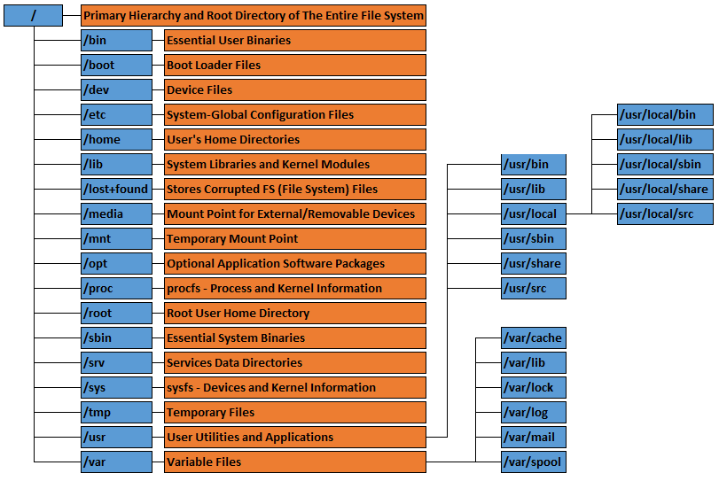
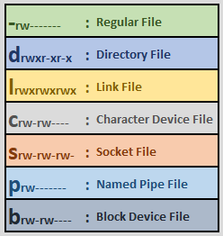

# Linux

## Table of Contents

- [Linux](#linux)
  - [Table of Contents](#table-of-contents)
  - [Root File System Structure](#root-file-system-structure)
  - [Linux File Types](#linux-file-types)
  - [General Useful Points](#general-useful-points)
    - [Using `sudo tee` instead of `>` \& `>>`](#using-sudo-tee-instead-of---)

## Root File System Structure



## Linux File Types

In Linux, everything is treated as a **file**. Linux file types are:

- **Regular File (`-`)**: The most common type — used for storing data, text, programs, images, etc. (e.g. `/etc/passwd`, `/bin/bash`)
- **Directory (`d`)**: A special file that stores information about other files (essentially a list of file names and inodes). (e.g. `/home`, `/etc`)
- **Symbolic Link (`l`)**: A reference (shortcut) to another file or directory. (e.g. /usr`/bin/python3 -> /usr/bin/python3.12`)
- **Character Device File (`c`)**: Used for devices that handle data character by character, like terminals, keyboards, or serial ports. (e.g. `/dev/tty`, `/dev/null`, `/dev/random`)
- **Block Device File (`b`)**: Represents devices that handle data in blocks — like hard drives, SSDs, or USB storage. (e.g. `/dev/sda`, `/dev/sdb1`)
- **FIFO (Named Pipe) (`p`)**: Enables inter-process communication (IPC) — data written by one process can be read by another in a first-in, first-out manner. (e.g. `/tmp/myfifo`)
- **Socket (`s`)**: Used for network or local inter-process communication. (e.g. `/var/run/docker.sock`, `/run/systemd/journal/socket`)

```sh
# List files
ls -l

# Displays human-readable type information
file <file>

# Gives detailed information including inode and file type
stat <file>

# Regular File
-rw-r--r--  1 user user  4096 Nov  1 10:00 notes.txt

# Directory
drwxr-xr-x  2 user user 4096 Nov  1 09:30 projects

# Symbolic Link
lrwxrwxrwx  1 root root  18 Nov  1 09:20 python3 -> /usr/bin/python3.12

# Character Device File
crw-rw-rw-  1 root tty 5, 0 Nov  1 09:00 /dev/tty

# Block Device File
brw-rw----  1 root disk 8, 1 Nov  1 08:50 /dev/sda1

# FIFO (Named Pipe)
mkfifo /tmp/myfifo
prw-r--r-- 1 user user 0 Nov  1 10:15 /tmp/myfifo

# Socket
srw-rw---- 1 root docker 0 Nov  1 09:00 /var/run/docker.sock
```



## General Useful Points

### Using `sudo tee` instead of `>` & `>>`

- `tee` reads from standard input (`stdin`) and writes it both to a file and to standard output (`stdout`).
- By default, `sudo tee` **overwrites** the file — just like normal redirection (`>`).

```sh
# if you need root permissions below command won’t work properly, because sudo only applies to echo, not to the redirection (>).
# The redirection is handled by your regular user shell, which likely doesn’t have permission to write to /etc.
sudo echo "text" > /etc/file

# you can solve this issue by using
echo "text" | sudo tee /etc/file

# if you don't want tee to print to terminal
echo "text" | sudo tee /etc/file > /dev/null

# if you want to append to a file
echo "new line" | sudo tee -a /etc/file

# above command behaves like this (but with root permissions)
echo "new line" >> /etc/file

# you can also pipe multi-line text to sudo tee
cat <<EOF | sudo tee /etc/file >/dev/null
...
EOF
```
